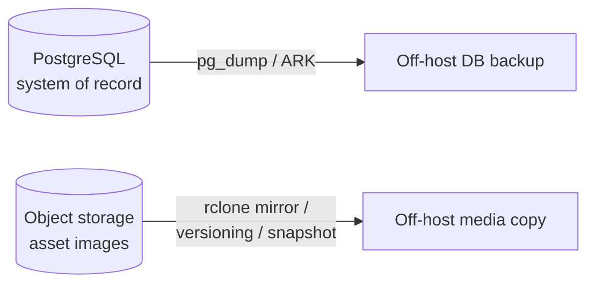

# What to protect

A PROPS deployment has **two independent data stores**. A complete backup
strategy covers both, but they differ sharply in how critical they are.

::: {.compact}
| Store | Holds | Where (default) | Criticality |
|---|---|---|---|
| **PostgreSQL** | Assets, transactions, users, locations, hold lists, kits, serial units — the system of record | `db` service / `postgres_data` volume | **Critical — irreplaceable** |
| **Object storage** | Uploaded asset images and other media | Garage (`garage_data` volume) or an external S3 bucket | Recoverable — lower stakes |
:::

The database is the priority: lose it and you lose the catalogue itself. Media
is recoverable in principle — a missing photo can be re-taken — so it warrants a
backup, but not the same rigour.



::: {.note}
**Cross-store consistency is not required.** Database rows reference media by
object key, and the two stores are backed up independently, so a restore can
briefly mismatch — a row pointing at an image not yet in the media copy, or an
orphaned image with no row. For an asset tracker this is harmless: orphans are
ignored and a missing thumbnail for a very recently-added asset is simply
re-uploaded. Do not engineer point-in-time consistency between the two.
:::

# Database backup

The database is small (a few MB even for large catalogues) and dumps in seconds.
Choose **one** of the approaches below depending on how you run PostgreSQL.

## Option A — `pg_dump` (works on any deployment)

The bundled `db` service is plain PostgreSQL 17, so the standard tools apply. Take
a **custom-format** dump (`-Fc`) — it is compressed and restores selectively with
`pg_restore`.

```bash
# From the deployment directory (where docker-compose.yml lives)
docker compose exec -T db \
  pg_dump -U props -Fc props \
  > "props-$(date +%Y%m%dT%H%M%SZ).dump"
```

Automate it with a **systemd timer** (preferred — catches up after downtime) or a
cron entry. A minimal cron example that keeps 30 days of daily dumps:

```cron
# /etc/cron.d/props-db-backup — daily at 02:30, prune dumps older than 30 days
30 2 * * * rwts cd /home/rwts/props && docker compose exec -T db pg_dump -U props -Fc props > /var/backups/props/props-$(date +\%Y\%m\%dT\%H\%M\%SZ).dump 2>> /var/log/props-db-backup.log && find /var/backups/props -name 'props-*.dump' -mtime +30 -delete
```

::: {.warn}
**A backup on the same host is not a backup.** A `pg_dump` sitting in
`/var/backups` dies with the server. Copy dumps **off the host** — to object
storage, a second machine, or an offsite location — and verify they arrive.
Disk-level redundancy (RAID) protects against drive failure, not against
deletion, corruption, ransomware, or losing the host.
:::

## Option B — managed-Postgres snapshots

If you run PROPS against a managed database (Amazon RDS, Google Cloud SQL, Azure
Database, etc.) rather than the bundled `db` container, use the provider's
**automated snapshots and point-in-time recovery** instead of `pg_dump`. Enable
daily snapshots, set the retention window, and confirm PITR is on. This is
generally the most robust option when it is available.

## Restoring the database

```bash
# Stop writers first, then restore into the existing database.
docker compose stop web-prod ws-prod celery-worker-prod celery-beat-prod

cat props-20260609T124728Z.dump | docker compose exec -T db \
  pg_restore -U props -d props --clean --if-exists --no-owner

docker compose start web-prod ws-prod celery-worker-prod celery-beat-prod
```

::: {.warn}
`--clean --if-exists` **drops and recreates objects** in the target database.
Only run it against the database you intend to overwrite. For a trial restore,
restore into a throwaway database (`createdb props_restore_test`) instead.
:::

# Database backup — RWTS-managed deployments (ARK)

RWTS-operated deployments use **ARK** (`rwts-backup`) for the database rather than
the `pg_dump` approach above. ARK provides encrypted, off-site, object-locked
backups in Wasabi, with decryption gated to a restricted group via Google Cloud
KMS — the backup host itself cannot read its own backups. It is disaster-recovery
tooling, not an everyday restore tool.

::: {.note}
**ARK is purely operational — it is not a dependency of PROPS.** It is installed
on the deployment host and runs as a Docker Compose sidecar (configured via a
host-local `backup.toml` + a root-only secrets file and a
`docker-compose.override.yml`). Nothing ARK-related is committed to this
repository or added to `pyproject.toml`. Open-source and self-hosted
deployments should use Option A or Option B above and have **no ARK
dependency**. ARK is internal RWTS infrastructure and is not available to
external deployments.
:::

# Content / media backup

The media store is whatever S3-compatible bucket PROPS writes to
(`AWS_STORAGE_BUCKET_NAME`, default `props-assets`) — Garage by default, or an
external S3 provider. Pick the approach that matches your storage.

## Primary — offsite bucket mirror with `rclone`

`rclone` (or MinIO's `mc mirror`) syncs the bucket to a second, independent
destination. This works identically for Garage and any S3 provider — only the
endpoint differs — which makes it the recommended default.

::: {.procedure}
1. Define two `rclone` remotes — `props` (the live bucket; for Garage, set
   `provider = Other` and `endpoint` to Garage's S3 address) and `offsite` (a
   different account/region/provider you control).
2. Mirror on a schedule:
   ```bash
   rclone sync props:props-assets offsite:props-assets-backup \
     --fast-list --transfers 8 --log-file /var/log/props-media-sync.log
   ```
3. Run it daily from cron or a systemd timer, the same way as the database dump.
:::

::: {.note}
`rclone sync` makes the destination **match** the source, so deletions
propagate. If you want protection against accidental deletion, enable
**versioning** on the destination bucket (below) or use `rclone copy` (additive)
instead of `sync`.
:::

## Alternative — S3 versioning + lifecycle

On a managed S3 provider, enable **object versioning** on the bucket and add a
**lifecycle rule** to expire noncurrent versions after a chosen window (e.g. 30
days). This protects against overwrite and deletion in place, with no external
job to run. It does **not** protect against loss of the bucket/region itself —
combine it with the offsite mirror above for that.

## Alternative — `garage_data` volume snapshot

For a single-host self-hosted Garage deployment, the simplest option is a
**filesystem snapshot of the `garage_data` Docker volume** (LVM/ZFS/btrfs
snapshot, or your hypervisor's volume snapshot), shipped off-host. Garage tolerates
a snapshot of a running store, but for a guaranteed-consistent copy, snapshot
during a quiet window.

## Restoring media

- **rclone mirror:** reverse the sync — `rclone sync offsite:props-assets-backup
  props:props-assets` — or restore selected keys with `rclone copy`.
- **Versioning:** restore the desired prior version via the provider console/CLI.
- **Volume snapshot:** stop the `garage` service, restore the volume from the
  snapshot, and start it again.

# Cadence, retention & testing

A sensible baseline for a community-organisation deployment:

::: {.kv}
Database
:   Daily dump (or managed snapshot). Keep 30 daily, then weekly for 12 months.

Media
:   Daily offsite mirror, plus destination versioning where available.

Off-host
:   Every backup must leave the host — verify it lands, don't assume.
:::

::: {.warn}
**A backup you have never restored is a hope, not a backup.** Periodically do a
restore drill: restore the latest database dump into a throwaway database and the
media into a scratch bucket, bring up a disposable PROPS instance against them,
and confirm assets and images load. Schedule this — quarterly is reasonable.
:::

# See also

- `docs/summary.md` — full product specification summary.
- ARK operator guide (`how-it-works.md` in the `django-backup-process` repo) —
  internal RWTS reference for the managed-deployment database backups.
