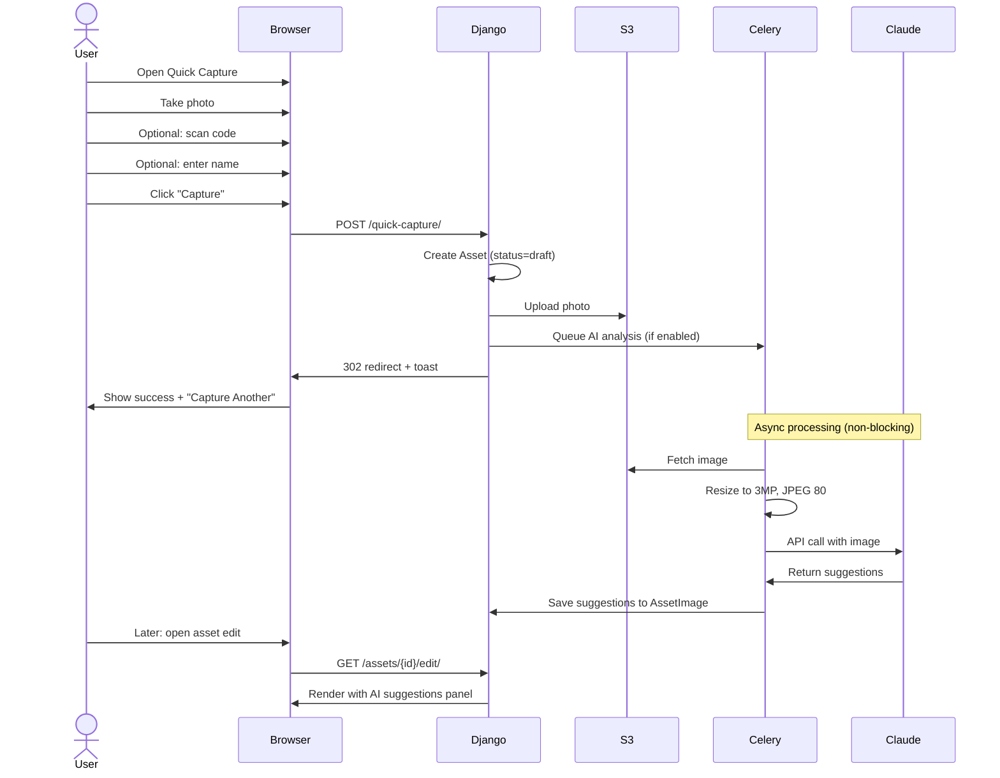
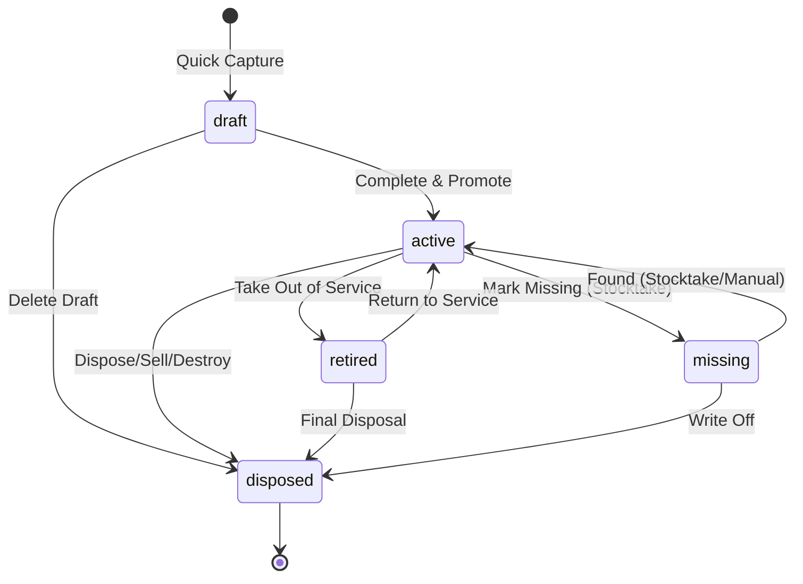
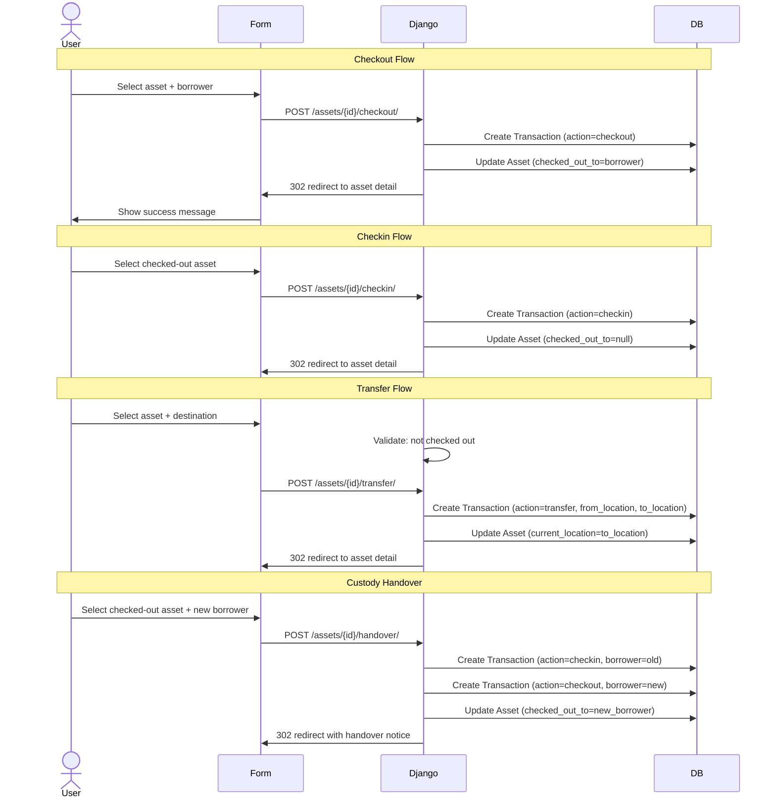
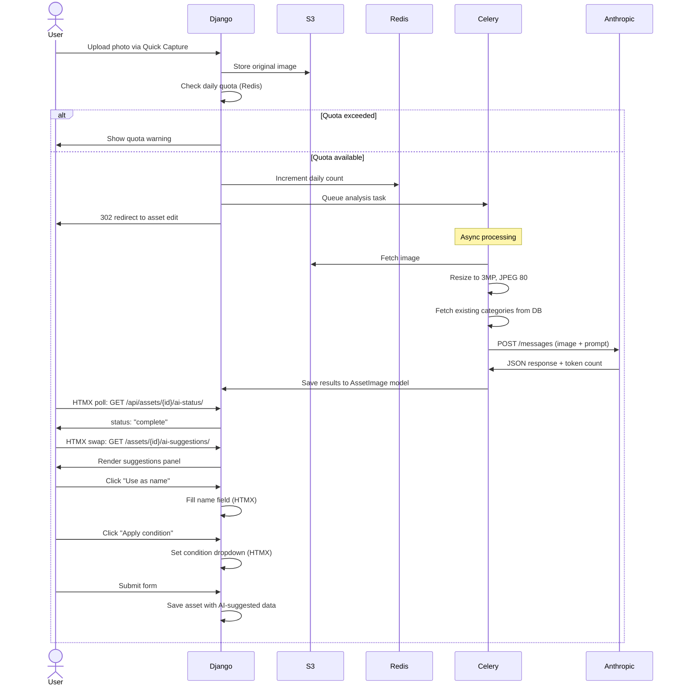
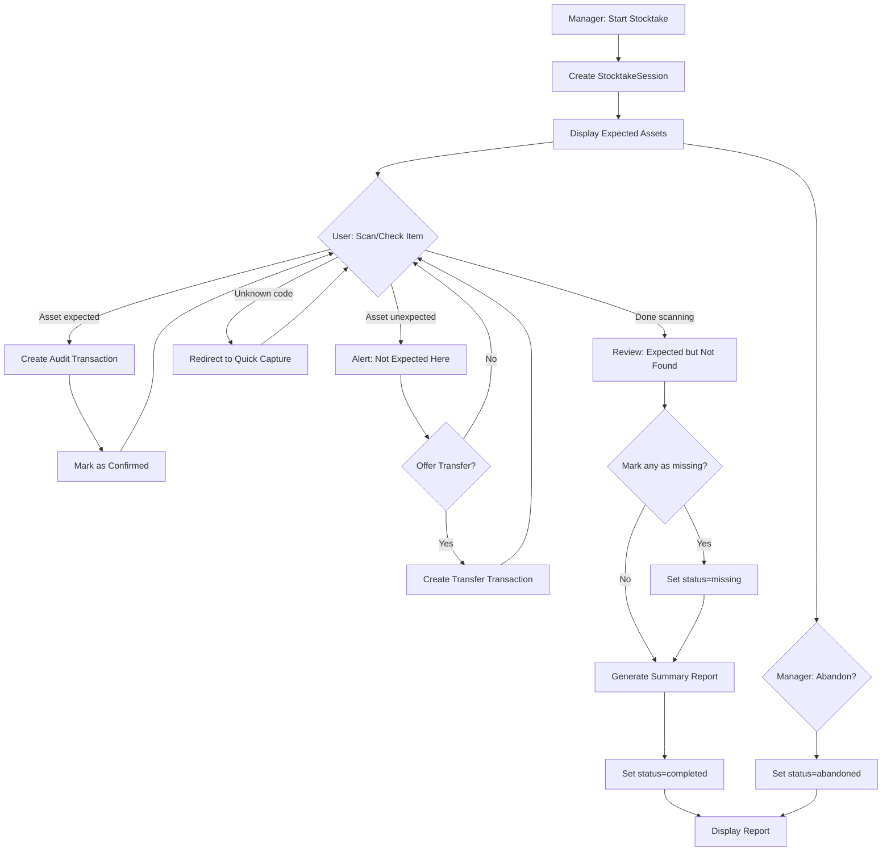
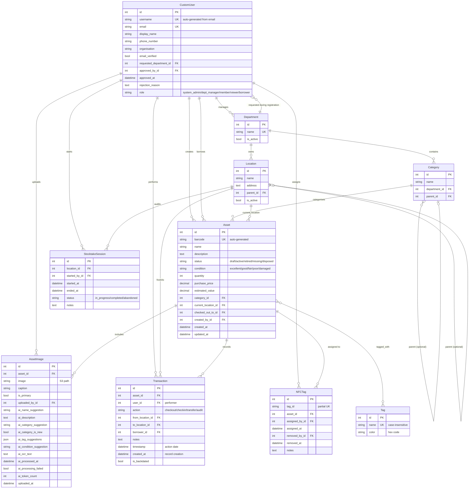
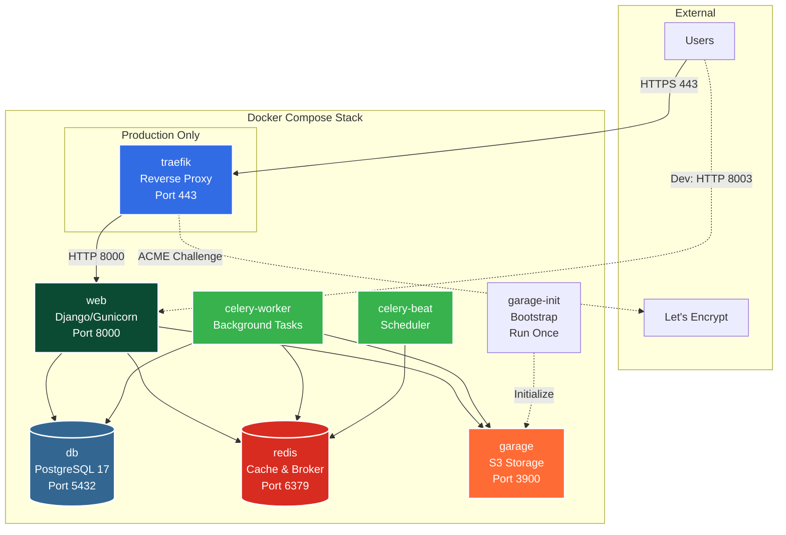

# PROPS — Platform Summary

**Property Register & Organisational Production System**

---

## Executive Summary

PROPS is a self-hosted, open source asset tracking platform purpose-built for community organisations — theatre groups, schools, community centres, clubs, and similar institutions that accumulate physical assets across years of productions and events. It provides a complete, searchable inventory system with photo cataloguing, hierarchical location tracking, borrower accountability, barcode and NFC tag scanning, stocktake workflows, and optional AI-powered image analysis for rapid cataloguing.

Built with Django 5.x, HTMX, PostgreSQL, and S3-compatible object storage, PROPS is designed to run on modest hardware while supporting organisations tracking up to 50,000 assets with 50 concurrent users. The platform emphasises mobile-first rapid capture workflows, departmental ownership models, and a full audit trail of all asset movements. Every transaction is immutably logged, providing complete accountability from acquisition through disposal.

PROPS is released under the AGPL-3.0 license, ensuring it remains free and open source even when deployed as a hosted service. Real World Technology Solutions (RWTS) offers commercial licensing, professional deployment services, custom branding, and ongoing support for organisations requiring service-level agreements or proprietary modifications. The platform is fully white-labelable with configurable branding, colour themes, logos, and email templates.

---

## The Problem

Community organisations accumulate large numbers of physical assets over years of operation — theatre props, costumes, lighting equipment, sound gear, set pieces, furniture, tools, and specialised equipment. These assets are frequently moved between storage locations during productions, borrowed by members for rehearsals or events, shared across shows, and stored in diverse locations ranging from purpose-built facilities to garage spaces and shipping containers.

Without a systematic tracking system, organisations face chronic operational problems:

- **No inventory visibility** — items forgotten in unlabelled boxes, storage areas, or borrowed by members who have since moved on
- **Lost assets** — no record of last known location, who last handled them, or when they were last seen
- **Wasted time** — hours spent searching for assets during production prep, often discovering items too late or not at all
- **Duplicate purchases** — buying items the organisation already owns but cannot locate, wasting limited budgets
- **No accountability** — no record of who borrowed items, when they were due back, or who moved them between locations
- **Insurance gaps** — inability to provide accurate inventories, valuations, or proof of ownership for insurance claims
- **Inefficient moves** — relocating storage facilities becomes chaotic without a system to catalogue items during packing

The immediate trigger for PROPS development was an asset relocation scenario: a community theatre group with thousands of items stored across multiple locations needed to consolidate into a single facility. Traditional methods (spreadsheets, paper lists, memory) proved inadequate for tracking items during the move, leading to lost assets, duplicate labelling, and incomplete records.

PROPS solves these problems by providing a mobile-first web application that makes it easy to catalogue, track, and manage physical assets across multiple storage locations with minimal overhead during the critical capture phase.

---

## How It Works

### Quick Capture

Quick Capture is the primary workflow for rapid asset creation during moves, stocktakes, or production load-ins. It is designed for speed and minimal friction, allowing volunteers to process dozens of items per hour using mobile devices.

**Workflow:**

1. User opens `/quick-capture/` on their mobile device (responsive design optimised for 320px-414px widths)
2. Takes a photo using the browser camera interface (file upload fallback for devices without camera access)
3. Optionally scans or manually enters a barcode or NFC tag using the integrated scanner
4. Optionally enters a name for the asset
5. Clicks "Capture" — asset is created immediately with `status=draft`

**Key behaviours:**

- **Minimum input:** Only ONE of photo, name, or scanned code is required. This allows maximum flexibility during rapid capture scenarios.
- **Auto-generated names:** If no name is provided, the system generates `"Quick Capture {MMM DD HH:MM}"` (e.g., "Quick Capture Feb 07 14:23") as a placeholder.
- **Code scanning:** The interface includes an integrated barcode/QR/NFC scanner using html5-qrcode library. Scanned codes are parsed:
  - If the code matches the barcode format `^[A-Z]+-[A-Z0-9]+$` (e.g., "PROPS-A1B2C3D4"), it is auto-assigned as the asset's barcode
  - Other codes are registered as NFC tag UIDs associated with the asset
- **Capture-Another flow:** After successful capture, the interface shows a toast confirmation with the asset name and a "Capture Another" button that clears the form for the next item
- **Draft status:** All Quick Capture assets are created with `status=draft`, indicating incomplete information. The `created_by` field records who captured the asset.
- **Concurrent sessions:** The system supports 5+ concurrent capture sessions without conflicts (optimistic locking, no required locks on shared resources)

**AI Analysis (if enabled):**

If the `ANTHROPIC_API_KEY` environment variable is set, the system automatically triggers AI image analysis as a Celery background task after the asset is created. The analysis is non-blocking — users can continue capturing immediately. Results appear in the asset edit interface when processing completes (typically 5-15 seconds per image).

**Drafts Queue:**

The Drafts Queue at `/assets/?status=draft` provides a paginated list of all draft assets ordered by creation date (newest first). Each row shows:

- Thumbnail image (if present)
- Auto-generated or user-provided name
- Barcode (if assigned)
- Creator name (with Gravatar avatar)
- Created timestamp (relative format: "2 hours ago")
- AI suggestion indicator icon if analysis is available

Users can click any draft to open the full edit interface and promote it to active status by completing required fields.

**Dashboard integration:**

The main dashboard shows a "Drafts" count widget with direct link to the queue, making it easy to track outstanding cataloguing work. The count updates in real-time as drafts are created and promoted.



---

### Asset Management

Assets are the core entity in PROPS. After initial capture, they can be edited, categorised, assigned locations, and tracked through their lifecycle.

**Fields:**

- **name** (CharField, max_length=200, required for active status): Human-readable asset name
- **description** (TextField, optional): Detailed description of the asset, condition notes, or identifying features
- **barcode** (CharField, max_length=50, unique, auto-generated): Unique identifier in format `{PREFIX}-{8-char-uppercase-hex}` (e.g., "PROPS-A1B2C3D4")
- **category** (ForeignKey to Category, nullable for drafts, required for active): Categorisation within department
- **current_location** (ForeignKey to Location, nullable for drafts, required for active): Physical storage location
- **quantity** (PositiveIntegerField, default=1): Number of identical items represented by this asset record
- **condition** (CharField, choices, default="good"): One of excellent, good, fair, poor, damaged
- **tags** (ManyToManyField to Tag): User-defined tags for flexible categorisation
- **notes** (TextField, optional): Internal notes, maintenance history, or special instructions
- **purchase_price** (DecimalField, optional, max_digits=10, decimal_places=2): Original purchase price
- **estimated_value** (DecimalField, optional, max_digits=10, decimal_places=2): Current replacement or market value
- **status** (CharField, choices, default="draft"): Lifecycle state (see Asset States below)
- **checked_out_to** (ForeignKey to User, nullable): Current borrower if asset is checked out
- **created_by** (ForeignKey to User): User who created the asset (auto-set)
- **created_at** (DateTimeField, auto_now_add): Creation timestamp
- **updated_at** (DateTimeField, auto_now): Last modification timestamp

**Edit Form Layout:**

The asset edit form at `/assets/{id}/edit/` is optimised for efficiency and mobile responsiveness:

- **Primary image:** Visible at top of form without scrolling (sidebar on desktop ≥1024px, above form fields on mobile)
- **Field priority:** Name, Status, Description, Category, Location, Condition appear at the top for quick access
- **Secondary fields:** Purchase Price, Estimated Value, Tags, Notes appear below the fold
- **AI Suggestions panel:** If AI analysis is available, suggestions appear in a collapsible panel below the primary image with action buttons (see AI-Powered Image Analysis section)

**CRUD Operations:**

- **Create:** Quick Capture (draft) or full form at `/assets/new/` (active)
- **Read:** Detail view at `/assets/{id}/`, list at `/assets/`, grid view at `/assets/?view=grid`
- **Update:** Edit form at `/assets/{id}/edit/`. Non-draft assets REQUIRE name, category, and current_location.
- **Delete:** Soft delete via `status=disposed`. Hard delete only available via Django admin for System Admins. Cannot delete checked-out assets (enforced at model level).

**Department/Category Ownership:**

Every category belongs to one department. Assets inherit their department via the category relationship. Draft assets may have `category=null` until promoted to active status. This inheritance model allows department-scoped permissions: Department Managers have full CRUD access to all assets in their department(s), regardless of who created them.

**Permission Model:**

- **System Admins:** Full CRUD on all assets
- **Department Managers:** Full CRUD on assets in their department(s)
- **Members:** Browse all assets (read-only), full CRUD on their own drafts (created_by=self)
- **Viewers:** Read-only access to all active assets

---

### Asset States

Assets progress through a defined lifecycle with five states. Transitions are controlled and some are restricted to specific user roles.



**State Definitions:**

| State | Description | Searchable by Default | Can Transition To | Permissions |
|-------|-------------|----------------------|-------------------|-------------|
| **draft** | Newly captured via Quick Capture, incomplete information. May lack name, category, or location. | No (explicit filter required) | active, disposed | Creator can edit/delete; Admins/Managers can edit/delete within department |
| **active** | Fully catalogued, complete metadata, in service. This is the default operational state. | Yes | retired, missing, disposed | Full CRUD by Admins/Managers; Members can checkout/checkin |
| **retired** | No longer in active use but retained for potential future use. Not available for checkout. | No (explicit filter required) | active, disposed | Admins/Managers only |
| **missing** | Asset cannot be located during stocktake or routine operations. Flagged for investigation. | No (explicit filter required) | active, disposed | Admins/Managers only |
| **disposed** | Terminal state. Asset sold, destroyed, donated, or otherwise removed from inventory. Soft-deleted. | No (System Admins only) | None | Cannot be modified; hard delete only in admin |

**Transition Logic:**

- **draft → active:** User completes required fields (name, category, current_location) and changes status dropdown to "Active". This is the primary workflow after Quick Capture.
- **active → retired:** Manager decides asset is no longer needed but wants to retain the record. Asset becomes non-searchable by default.
- **active → missing:** During stocktake, asset is expected at a location but cannot be found. System offers "Mark Missing" action. Can also be manually set.
- **retired/missing → active:** Asset is found or returned to service. Location and condition may be updated during reactivation.
- **Any → disposed:** Final removal from inventory. Records are retained for audit history but excluded from all normal searches.

**Search Behaviour:**

- Default search at `/assets/` shows only `status=active`
- Explicit filters are required to view `draft`, `retired`, or `missing` assets
- `disposed` assets are visible only to System Admins via a dedicated admin view

---

### Check-In / Check-Out / Transfer

PROPS tracks all asset movements through four transaction types: checkout, checkin, transfer, and audit. Every transaction is immutably recorded in the Transaction model, providing complete audit history.

**Transaction Types:**

1. **Checkout:** Records a member borrowing an asset. The asset's `current_location` is RETAINED as the "home location" and `checked_out_to` is set to the borrower. This allows the system to track where the asset should be returned.

2. **Checkin:** Records the return of a borrowed asset. Clears `checked_out_to`. Optionally updates `current_location` if the asset is being returned to a different location than its home.

3. **Transfer:** Moves an asset between two locations. Updates `current_location`. Asset must NOT be checked out (enforced at form level and model validation). No borrower involved.

4. **Audit:** Confirms physical presence during stocktake. Records verification timestamp but does not change `current_location` or `checked_out_to`. Used to build stocktake coverage reports.

**Transaction Model Fields:**

- **asset** (ForeignKey to Asset): The asset being moved
- **action** (CharField, choices): One of checkout, checkin, transfer, audit
- **user** (ForeignKey to User): Person who performed the transaction
- **borrower** (ForeignKey to User, nullable): Person borrowing the asset (checkout only)
- **from_location** (ForeignKey to Location, nullable): Origin location (transfer, checkin)
- **to_location** (ForeignKey to Location, nullable): Destination location (transfer, checkin)
- **notes** (TextField, optional): Reason, production name, or other context
- **timestamp** (DateTimeField): When the action occurred (may differ from created_at if backdated)
- **created_at** (DateTimeField, auto_now_add): When the transaction record was created
- **is_backdated** (BooleanField, default=False): True if timestamp < created_at (retrospective logging)
- **Immutable:** Once created, transactions cannot be modified or deleted (enforced via model permissions)

**Custody Handover:**

A special workflow for transferring custody of a checked-out asset from one borrower to another without returning it to its home location. Available only for assets where `checked_out_to` is not null.

**Process:**

1. Admin or Manager selects "Custody Handover" action on a checked-out asset
2. Selects new borrower from user dropdown
3. System creates TWO transactions with identical timestamps:
   - Checkin transaction (user = performer, borrower = original borrower, notes = "Custody handover")
   - Checkout transaction (user = performer, borrower = new borrower, notes = "Custody handover from [original borrower]")
4. Asset's `checked_out_to` is updated to new borrower
5. Both transactions appear in history with handover notation

**Transaction Backdating:**

For retrospective logging (e.g., recording a move that happened yesterday), the transaction form includes an optional "Date of action" field. If provided:

- `timestamp` is set to the provided date/time
- `is_backdated` is set to True
- Future-dated timestamps are rejected with validation error
- Backdated transactions are visually marked in the history list with a clock icon

**Bulk Operations:**

- **Bulk Checkout:** Select multiple assets → checkout to one borrower. Creates N transactions in a single database call using `bulk_create()`.
- **Bulk Checkin:** Select multiple checked-out assets → checkin to one location. Uses `bulk_create()` for transactions + `update()` for asset fields.
- **Bulk Transfer:** Select multiple assets (excluding checked-out) → transfer to one location. Enforced: no checked-out assets in selection.



---

### Barcode & NFC

Every asset in PROPS receives a unique barcode for physical identification and scanning. NFC tags can also be assigned for use cases where barcodes are impractical (e.g., costumes, soft goods).

**Barcode Generation:**

- **Format:** `{PREFIX}-{8-char-uppercase-hex}` (e.g., "PROPS-A1B2C3D4")
- **Prefix:** Configurable via `BARCODE_PREFIX` environment variable (default: "PROPS"). Allows organisations to brand their codes.
- **Encoding:** Code128, chosen for high density and wide scanner support
- **Generation:** Automatic on asset creation using `secrets.token_hex(4).upper()` (cryptographically random)
- **Uniqueness:** Enforced by unique constraint on Asset.barcode field

**Label Printing — Three Tiers:**

PROPS supports three label printing methods to accommodate different hardware setups:

1. **Browser Print (CSS):**
   - URL: `/assets/{id}/label/` or bulk at `/assets/labels/?ids=1,2,3`
   - CSS `@media print` rules format the page for 62mm × 29mm label sheets (e.g., Avery L7651)
   - Each label includes:
     - Code128 barcode (rendered as SVG via python-barcode)
     - QR code encoding asset detail URL `https://{domain}/assets/{id}/` (rendered via qrcode library)
     - Asset name (truncated to 30 chars if necessary)
     - Organisation name (from SITE_SHORT_NAME)
   - User prints via browser print dialog (Ctrl+P / Cmd+P)

2. **USB Thermal Printer:**
   - Same HTML/CSS as browser print
   - User selects thermal printer as print destination
   - Browser handles print spooling
   - Tested with Brother QL-series label printers

3. **Zebra ZPL (Network Printer):**
   - URL: `/assets/{id}/label/zpl/` or bulk at `/assets/labels/zpl/?ids=1,2,3`
   - Server-side ZPL markup generation
   - Sent directly to printer via TCP connection to port 9100
   - Requires `ZEBRA_PRINTER_HOST` environment variable (IP address or hostname)
   - ZPL template includes barcode (^BC), text fields (^FD), and graphic (^GF for QR)
   - Success confirmation page with "Print another" link

**NFC Tag Assignment:**

The NFCTag model tracks NFC tag assignments with full history, allowing tags to be reused across different assets over time.

**NFCTag Model Fields:**

- **tag_id** (CharField, max_length=50): Unique NFC tag UID (typically 8-14 hex characters)
- **asset** (ForeignKey to Asset): Currently assigned asset
- **assigned_at** (DateTimeField): When the tag was assigned to this asset
- **assigned_by** (ForeignKey to User): Who assigned the tag
- **removed_at** (DateTimeField, nullable): When the tag was unassigned (null = currently active)
- **removed_by** (ForeignKey to User, nullable): Who removed the tag
- **notes** (TextField, optional): Assignment context or removal reason

**Constraints:**

- Partial unique constraint on `(tag_id)` where `removed_at IS NULL` (only one active assignment per tag_id)
- History is retained: when a tag is reassigned, the previous record has `removed_at` set, and a new record is created

**NFC Reading — Platform-Specific:**

- **Android (Chrome 89+):** Web NFC API via JavaScript. Browser prompts user to scan tag, then reads NDEF payload or UID directly. Requires HTTPS. Implemented in asset detail and Quick Capture views.

- **iOS (Safari):** No Web NFC API support. Tags must contain NDEF URL records: `https://{domain}/a/{tag_id}/`. When user taps the tag with their iPhone, iOS automatically opens Safari to that URL. The lookup endpoint resolves the tag_id to the asset and redirects.

**Unified Lookup Endpoint:**

`/a/{identifier}/` resolves an identifier using this priority:

1. Check if identifier matches Asset.barcode (exact match) → redirect to `/assets/{id}/`
2. Check if identifier matches NFCTag.tag_id where removed_at IS NULL → redirect to asset
3. If no match found → redirect to Quick Capture with identifier pre-filled as scanned code

This endpoint is used for:

- QR codes printed on labels (encode `https://{domain}/a/{barcode}/`)
- NFC tags (NDEF URL record points to `https://{domain}/a/{tag_id}/`)
- Manual barcode entry in search forms

---

### AI-Powered Image Analysis

PROPS includes optional AI-powered image analysis to accelerate asset cataloguing. When enabled, Claude's vision models analyse uploaded photos and suggest structured metadata. This feature is particularly valuable during bulk capture sessions when volunteers are processing hundreds of items.

**Enabling the Feature:**

Set the `ANTHROPIC_API_KEY` environment variable to a valid Anthropic API key. If the variable is not set or empty, the feature is silently disabled — no errors, warnings, or UI changes. This allows organisations to deploy PROPS without AI and enable it later without code changes.

**Model Configuration:**

- **Model:** `claude-sonnet-4-20250514` (default, configurable via `AI_MODEL_NAME` environment variable)
- **Why Sonnet:** Balance of cost, speed, and accuracy. Handles detailed prop identification well. Opus 4.6 can be configured for higher accuracy at increased cost.
- **Image Preparation:** Before sending to API, images are resized to a 3-megapixel target (e.g., 2048×1536) using Pillow with LANCZOS resampling, converted to JPEG with quality=80, and capped at 1MB. This reduces API costs while maintaining sufficient detail for identification.

**Analysis Trigger:**

Analysis is triggered automatically when:

1. A photo is uploaded via Quick Capture
2. A photo is added to an existing asset via the edit form
3. The primary image is changed on an asset

The trigger creates a Celery task that executes asynchronously (non-blocking). The user can continue working immediately.

**Analysis Capabilities:**

The AI prompt instructs Claude to analyse the image and return a JSON structure with the following fields:

1. **name_suggestion** (string): A concise, descriptive name (e.g., "Victorian Armchair, Red Velvet", "LED Par Can Spotlight", "1920s Flapper Dress")
2. **description** (string): 2-3 sentence description including materials, condition notes, distinctive features, and any visible damage
3. **category_suggestion** (string): Best-fit category from the existing category list included in the prompt
4. **category_is_new** (boolean): True if the AI thinks a new category should be created (suggested name in category_suggestion)
5. **tag_suggestions** (array of strings): 3-5 relevant tags (e.g., ["period", "1920s", "costume", "formal"])
6. **condition_suggestion** (string): One of excellent, good, fair, poor, damaged based on visible condition
7. **ocr_text** (string): Any readable text visible in the image (labels, signs, serial numbers, manufacturer marks)

**Prompt Engineering:**

The prompt includes:

- List of existing category names from the database → encourages AI to prefer existing categories over suggesting new ones
- Department names to provide organisational context
- Examples of good vs. poor name suggestions (specific vs. generic)
- Instruction to flag new categories rather than force-fitting into inappropriate existing categories
- Instruction to be conservative with condition assessments (visible damage only, not presumed wear)

**Storage:**

All AI results are stored on the AssetImage model in dedicated fields:

- `ai_name_suggestion` (CharField, max_length=200, nullable)
- `ai_description` (TextField, nullable)
- `ai_category_suggestion` (CharField, max_length=100, nullable)
- `ai_category_is_new` (BooleanField, default=False)
- `ai_tag_suggestions` (JSONField, nullable, stores array of strings)
- `ai_condition_suggestion` (CharField, max_length=20, nullable)
- `ai_ocr_text` (TextField, nullable)
- `ai_processed_at` (DateTimeField, nullable): Timestamp when analysis completed
- `ai_processing_failed` (BooleanField, default=False): True if API call failed
- `ai_token_count` (IntegerField, nullable): Total tokens used (for cost tracking)

**AI Suggestions Panel:**

When editing an asset that has AI analysis results, a collapsible "AI Suggestions" panel appears below the primary image with the following action buttons:

- **Name:** "Use as name" (fills name field, replacing existing) or "Keep current name"
- **Description:** "Use as description" (replaces existing), "Append to description" (adds to end with newline separator), or "Ignore"
- **Category:** If `category_is_new=False`: "Apply" button (standard styling, sets category dropdown). If `category_is_new=True`: "Create & Apply" button (secondary/warning styling, creates new category via modal then sets dropdown) or "Ignore"
- **Tags:** Each suggested tag has an "Add" button that adds it to the tags multiselect (skips if already present)
- **Condition:** "Apply condition" button sets condition dropdown
- **OCR Text:** "Copy to notes" button appends extracted text to notes field with "— Extracted text:" prefix

All actions are HTMX-powered with optimistic UI updates. No page reload required.

**Status Polling:**

While analysis is in progress, the asset edit page includes an HTMX polling mechanism (`hx-get="/api/assets/{id}/ai-status/"` with `hx-trigger="every 5s"`). The endpoint returns:

- `status: "processing"` → Shows spinner and "Analysing image..." message
- `status: "complete"` → Triggers `hx-swap="outerHTML"` to replace spinner with suggestions panel
- `status: "failed"` → Shows error message with "AI analysis failed. Please try again later."

**Cost Controls:**

To prevent runaway API costs, PROPS implements daily quotas:

- **Daily Limit:** `AI_ANALYSIS_DAILY_LIMIT` environment variable (default: 100 images per day)
- **Reset Time:** Midnight in the server's timezone
- **Quota Tracking:** Redis key `ai_analysis_daily_count:{YYYY-MM-DD}` incremented on each analysis
- **Enforcement:** If quota is exceeded, analysis is skipped with a user-friendly message: "Daily AI analysis limit reached. Quota resets at midnight."
- **Dashboard Widget:** Admins see an "AI Usage" widget on the dashboard showing `{count} / {quota}` for the current day

**Token Logging:**

Each analysis logs token usage in the `ai_token_count` field on AssetImage. This allows administrators to:

- Track total API costs over time (sum of all token counts × model pricing)
- Identify particularly complex images (high token counts may indicate oversized images)
- Audit cost efficiency (cost per successfully catalogued asset)

**Privacy & Security:**

- Only the image file is sent to the Anthropic API
- No personally identifiable information (user names, emails, locations) is included in the prompt
- Asset names, descriptions, and other metadata are NOT sent to the API
- API responses are stored only in the PROPS database (not cached externally)
- API key is stored as an environment variable, never committed to version control



---

### Search & Browse

PROPS provides flexible search and filtering capabilities optimised for rapid asset discovery during productions, stocktakes, and routine operations.

**Text Search:**

The main search at `/assets/?q={query}` performs case-insensitive substring matching across:

- `Asset.name` (icontains)
- `Asset.description` (icontains)
- `Asset.barcode` (icontains)
- `NFCTag.tag_id` (icontains, via M2M relation)
- `Tag.name` (icontains, via M2M relation)

**Implementation:**

Django Q objects with OR logic:

```python
Q(name__icontains=query) |
Q(description__icontains=query) |
Q(barcode__icontains=query) |
Q(nfctag__tag_id__icontains=query) |
Q(tags__name__icontains=query)
```

Followed by `.distinct()` to remove duplicates from M2M joins.

**Upgrade Path:**

For deployments exceeding 10,000 assets, PostgreSQL full-text search with GIN indexes can be implemented for better performance. The current implementation is adequate for the 50,000-asset target scale.

**Filters:**

All filters use AND logic and are preserved across pagination via URL query string (bookmarkable):

| Filter | Parameter | Description |
|--------|-----------|-------------|
| Department | `department={id}` | Assets in specified department (via category.department) |
| Category | `category={id}` | Assets in specified category |
| Location | `location={id}` | Assets where `current_location={id}` OR pseudo-location "Checked Out" (where `checked_out_to IS NOT NULL`) |
| Tag | `tag={id}` | Assets tagged with specified tag |
| Condition | `condition={choice}` | One of excellent, good, fair, poor, damaged |
| Status | `status={choice}` | One of draft, active, retired, missing, disposed (default: active) |

**Pseudo-Location: "Checked Out":**

The location filter dropdown includes a special option "Checked Out" (value=`__checked_out__`) that filters to assets where `checked_out_to IS NOT NULL`. This allows users to quickly find all borrowed items regardless of their home location.

**View Modes:**

Users can toggle between two view modes via a cookie-persisted preference:

1. **List View (default):** Tabular layout with columns: Thumbnail, Name, Barcode, Category, Location, Condition, Status, Actions. Sortable by Name, Category, Location, Status.
2. **Grid View:** Photo card layout optimised for visual browsing. Each card shows: primary image (or placeholder), name (truncated), barcode, category, location icon + name. Click anywhere on card to open detail view.

Toggle buttons appear in the top-right of the search results page. The selected view is stored in `request.session['asset_view']` and persists across sessions.

**Pagination:**

- **Default:** 25 items per page
- **Options:** 25, 50, 100 (via dropdown in pagination controls)
- **Preference:** Stored in cookie `assets_per_page` (expires in 1 year)
- **Filters Preserved:** All query parameters (`q`, `department`, `category`, etc.) are appended to pagination links so users don't lose their search context when navigating pages

**Sort Order:**

Default sort is `-updated_at` (most recently modified first). When filtering by `status=draft`, sort becomes `-created_at` (newest drafts first) to prioritise recent Quick Capture sessions.

---

### Stocktake

Stocktake is a formal audit workflow for verifying physical presence of assets at a location. It is designed for periodic inventory reviews, move reconciliations, and insurance audits.

**StocktakeSession Model:**

- **location** (ForeignKey to Location): The location being audited
- **started_by** (ForeignKey to User): Who initiated the stocktake
- **started_at** (DateTimeField): When the session began
- **ended_at** (DateTimeField, nullable): When the session was completed or abandoned
- **status** (CharField, choices): One of in_progress, completed, abandoned
- **notes** (TextField, optional): Session summary, discrepancies, or findings

**Constraint:** Only one `in_progress` session per location (enforced by unique constraint on `location` where `status='in_progress'`).

**Workflow:**

1. **Start Stocktake:** Manager navigates to location detail page at `/locations/{id}/` and clicks "Start Stocktake". System creates `StocktakeSession(status='in_progress')`.

2. **Expected Assets:** System displays all assets where `current_location={id}` AND `status IN ('active', 'missing')`. Checked-out assets (where `checked_out_to IS NOT NULL`) are EXCLUDED from the expected list because they are not physically at the location.

3. **Confirm Presence:** For each expected asset, user:
   - Scans barcode/NFC tag using integrated scanner → auto-confirms
   - Manually checks checkbox next to asset name → confirms
   - Confirming creates a `Transaction(action='audit', location={id}, timestamp=now())`

4. **Discrepancies:**
   - **Found but not expected:** User scans an asset that has `current_location != {id}`. System shows alert: "Asset [name] is registered at [other location]. Transfer here?" → Offer "Transfer" button that creates transfer transaction.
   - **Unknown item:** User scans a barcode/NFC that doesn't exist in the database. System redirects to Quick Capture with code pre-filled.
   - **Expected but not found:** After scanning all present items, any expected assets without an audit transaction are listed as "Not Found". User can click "Mark Missing" to set `status='missing'`.

5. **Complete Session:** Manager clicks "Complete Stocktake". System:
   - Sets `status='completed'`, `ended_at=now()`
   - Generates summary report:
     - Total expected: N assets
     - Confirmed present: M assets
     - Not found: N - M assets (list with names and barcodes)
     - Unexpected items: X assets transferred in
     - New captures: Y assets created
   - Report is displayed as HTML (printable) and optionally saved as PDF

**Abandon Session:**

If a stocktake cannot be completed (e.g., team runs out of time), manager can click "Abandon Stocktake". This sets `status='abandoned'` without changing any asset statuses. No assets are marked missing. The session remains in history for audit purposes.

**Multiple Concurrent Stocktakes:**

PROPS supports multiple concurrent stocktakes at different locations. Each session is scoped to one location and one team. Sessions are independent and do not interfere with each other.



---

### Bulk Operations

To improve efficiency during common workflows (move reconciliation, label printing, status updates), PROPS provides several bulk operations accessible via checkbox selections on the asset list page.

**Selection Mechanisms:**

1. **Per-Row Checkboxes:** Each asset row includes a checkbox with `value={asset.id}`
2. **Select All on Page:** Checkbox in table header selects all visible assets on the current page (respects pagination)
3. **Select All Matching:** Button above the table that submits a form with the current filter criteria (department, category, location, status, etc.) to select ALL matching assets across all pages. This is implemented via a hidden form that includes all query parameters.

**Warning:** "Select All Matching" shows a confirmation modal: "This will select N assets matching your filters. Continue?" to prevent accidental mass operations.

**Bulk Transfer:**

- **URL:** `/assets/bulk-transfer/`
- **Input:** Array of asset IDs + destination location ID
- **Validation:** Excludes checked-out assets (where `checked_out_to IS NOT NULL`). If any selected assets are checked out, they are skipped with a warning message: "Skipped N checked-out assets. They must be checked in first."
- **Execution:**
  - Create N `Transaction` records via `Transaction.objects.bulk_create()` (single query)
  - Update all assets via `Asset.objects.filter(id__in=ids).update(current_location=location)` (single query)
  - Show success message: "Transferred N assets to [location name]"

**Bulk Checkout:**

- **URL:** `/assets/bulk-checkout/`
- **Input:** Array of asset IDs + borrower User ID
- **Validation:** Assets must be `status='active'` and not already checked out
- **Execution:**
  - Create N `Transaction` records via `bulk_create()`
  - Update all assets via `update(checked_out_to=borrower)`
  - Show success message: "Checked out N assets to [borrower name]"

**Bulk Checkin:**

- **URL:** `/assets/bulk-checkin/`
- **Input:** Array of asset IDs + optional destination location ID
- **Validation:** All selected assets must be currently checked out
- **Execution:**
  - Create N `Transaction` records via `bulk_create()`
  - Update all assets via `update(checked_out_to=None)` + optionally `update(current_location=location)` if location provided
  - Show success message: "Checked in N assets"

**Bulk Label Printing:**

- **Browser Print:** `/assets/labels/?ids=1,2,3` → Single HTML page with all labels formatted for 62mm × 29mm label sheets
- **ZPL:** `/assets/labels/zpl/?ids=1,2,3` → Single ZPL document sent to network printer with all labels

**Bulk Edit (Drafts Only):**

- **URL:** `/assets/bulk-edit/`
- **Input:** Array of draft asset IDs + category ID + location ID (both optional)
- **Purpose:** Quickly assign category/location to multiple Quick Capture drafts during post-move cleanup
- **Behaviour:** Only updates fields that are explicitly selected. Blank fields are ignored (no overwriting). Useful for "All these boxes are Furniture in Storage Room 3" scenarios.
- **Execution:** Single `update()` query with conditional field inclusion

**Performance:**

Bulk operations use Django's `bulk_create()` and `update()` to minimise database queries. Testing confirms 100 assets can be transferred in <200ms on modest hardware (2 vCPU, 4GB RAM).

---

### Asset Merge

Asset Merge is a deduplication operation for cases where two asset records represent the same physical item (e.g., duplicate Quick Capture entries, pre-merge inventory from different teams).

**Access:**

Admin and Department Managers only. Accessible from asset detail page via "Merge with another asset" link in the actions dropdown.

**Workflow:**

1. User navigates to the "primary" asset (the one that will remain)
2. Clicks "Merge with another asset"
3. Searches for the "secondary" asset (the one to merge in and dispose)
4. Reviews merge preview showing what will be transferred:
   - All images from secondary → added to primary
   - All tags from secondary → added to primary (skips duplicates)
   - All NFC tags from secondary → reassigned to primary (history preserved)
   - All transactions from secondary → updated to reference primary
5. Confirms merge
6. System executes:
   - `AssetImage.objects.filter(asset=secondary).update(asset=primary)`
   - `primary.tags.add(*secondary.tags.all())`
   - `NFCTag.objects.filter(asset=secondary).update(asset=primary)`
   - `Transaction.objects.filter(asset=secondary).update(asset=primary)`
   - `secondary.status = 'disposed'`
   - `secondary.notes += f"\n\nMerged into asset {primary.barcode} on {date} by {user}."`
   - `secondary.save()`
7. Redirect to primary asset with success message: "Merged [secondary name] into this asset."

**Important:** The secondary asset is soft-deleted (set to `status='disposed'`), not hard-deleted. This preserves audit history and allows reversal if the merge was performed in error.

**Constraints:**

- Both assets must be in the same department (enforced via form validation)
- Cannot merge checked-out assets (user must check in first)
- Cannot merge disposed assets

---

### Exports

PROPS provides Excel export functionality for insurance reporting, external audits, and offline analysis.

**URL:** `/assets/export/excel/` (respects current search filters and query parameters)

**Format:** `.xlsx` (Office Open XML) generated via openpyxl

**Sheets:**

1. **Assets Sheet:** One row per asset with 15 columns:
   - Name
   - Description (truncated to 500 chars)
   - Barcode
   - Category (name)
   - Department (name, via category)
   - Location (full hierarchical path, e.g., "Building A > Floor 2 > Room 203")
   - Condition
   - Status
   - Purchase Price (formatted as currency)
   - Estimated Value (formatted as currency)
   - Tags (comma-separated list of tag names)
   - Quantity
   - Created Date (YYYY-MM-DD)
   - Last Updated (YYYY-MM-DD)
   - Checked Out To (borrower display name or blank)

2. **Summary Sheet:** Aggregations for insurance and budgeting:
   - Total Assets: count
   - Total Estimated Value: sum of `estimated_value`
   - By Department: count and total estimated value per department
   - By Category: count and total estimated value per category
   - By Condition: count per condition level

**Filename:** `props-assets-export-{YYYY-MM-DD}.xlsx` (date reflects export date, not asset date range)

**Performance:**

- Small exports (<1000 assets): Synchronous generation, immediate download
- Large exports (1000-50000 assets): Offloaded to Celery task. User receives email with download link when ready. Download link expires after 7 days (pre-signed S3 URL).

**Filters Preserved:**

The export respects all active filters from the search page (department, category, location, status, etc.). This allows users to export specific subsets: "All props in Storage Room 3", "All retired lighting equipment", etc.

---

### Dashboard

The dashboard at `/` (root URL, requires login) provides an at-a-glance overview of the asset inventory and recent activity.

**Summary Metrics (Top Row):**

- **Total Active Assets:** Count of `status='active'`
- **Draft Assets:** Count of `status='draft'` with link to Drafts Queue
- **Checked Out:** Count where `checked_out_to IS NOT NULL`
- **Missing:** Count of `status='missing'`
- **Total Estimated Value:** Sum of `estimated_value` for active assets (formatted as currency)

**Breakdowns (Grid Layout):**

- **By Department:** Donut chart + table showing count and percentage per department
- **By Category:** Bar chart showing top 10 categories by asset count
- **By Location:** Bar chart showing top 10 locations by asset count
- **By Tag:** Cloud-style list of top 10 most-used tags with counts

**Recent Activity (Timeline):**

- List of 10 most recent transactions (all types: checkout, checkin, transfer, audit)
- Each entry shows:
  - Icon indicating transaction type (arrow-right for checkout, arrow-left for checkin, arrows-left-right for transfer, magnifying-glass for audit)
  - Asset name (linked to detail page)
  - Action description (e.g., "checked out to [name]", "transferred from [location A] to [location B]")
  - User avatar (Gravatar, 24px) + user display name
  - Relative timestamp ("2 hours ago", "yesterday", etc.)

**Quick Links (Action Cards):**

- **Quick Capture:** Large button linking to `/quick-capture/`
- **Search Assets:** Link to `/assets/`
- **Create Asset:** Link to `/assets/new/`
- **Start Stocktake:** Dropdown to select location, then link to `/stocktake/start/?location={id}`

**AI Usage Widget (if enabled):**

If `ANTHROPIC_API_KEY` is set, System Admins see an "AI Usage" card showing:

- Today's date
- "N / M images analysed" (N = count from Redis, M = `AI_ANALYSIS_DAILY_LIMIT`)
- Progress bar visualising quota usage
- Text: "Quota resets at midnight"

**Role-Based Customisation:**

- **Members:** See only active assets in their own department(s) in the metrics. Cannot see financial totals.
- **Department Managers:** See full metrics for their department(s). Can see estimated values for their departments only.
- **System Admins:** See full organisation-wide metrics including financial totals and AI usage.

---

### Location Management

Locations represent physical storage areas and are organised hierarchically to mirror real-world facility structures.

**Location Model Fields:**

- **name** (CharField, max_length=100): Location name (e.g., "Storage Room 3", "East Wing", "Shelf B")
- **address** (TextField, optional): Physical address or GPS coordinates for buildings
- **parent** (ForeignKey to self, nullable): Parent location for hierarchical organisation
- **is_active** (BooleanField, default=True): Soft-delete flag (inactive locations are hidden from dropdowns)
- **created_at** / **updated_at** (DateTimeFields): Audit timestamps

**Hierarchy:**

Supports up to 4 levels of nesting:

- **Level 1:** Building / Facility (no parent)
- **Level 2:** Floor / Wing (parent = building)
- **Level 3:** Room / Area (parent = floor)
- **Level 4:** Section / Shelf (parent = room)

Example: "Theatre Building" → "Floor 2" → "Props Storage" → "Shelf A"

**Circular Reference Prevention:**

The `save()` method on Location includes validation to prevent circular references:

```python
def clean(self):
    if self.parent:
        current = self.parent
        while current:
            if current == self:
                raise ValidationError("Circular reference detected")
            current = current.parent
```

**Unique Constraint:**

Location names must be unique within their parent. This allows multiple "Shelf A" locations (one per room) while preventing duplicate "Shelf A" entries in the same room.

Database constraint: `UNIQUE(name, parent_id)`

**Location Detail View:**

`/locations/{id}/` shows:

- Location name + full hierarchical path (breadcrumb)
- Address (if set)
- Parent location (linked)
- Child locations (if any, as collapsible list)
- **Assets at This Location:** Paginated table of all assets where `current_location={id}` (default: 25 per page)
- **Start Stocktake Button:** Initiates StocktakeSession for this location (visible to Admins/Managers only)

**Soft Delete:**

Setting `is_active=False` hides the location from:

- Location dropdown in asset edit forms
- Location filter in search
- Stocktake location selection

Existing assets retain their `current_location` reference, but the location appears with "(inactive)" suffix in read-only displays.

---

## Data Model

PROPS organises data around ten core entities with well-defined relationships. The schema is designed for read-heavy workloads (asset searches, transaction history) with optimised indexes and denormalised fields where appropriate.



**Entity Descriptions:**

### Department

Represents organisational divisions (Props, Costumes, Technical, Sound, Lighting, etc.). Each department is autonomous with its own managers, categories, and locations.

**Key Fields:**

- `name` (CharField, max_length=100, unique): Department name
- `managers` (ManyToManyField to CustomUser): Users with management permissions for this department
- `is_active` (BooleanField, default=True): Soft-delete flag

### Category

Asset classifications within a department. Categories can be hierarchical (parent-child) for nested organisation (e.g., "Costumes" > "Period" > "Victorian").

**Key Fields:**

- `name` (CharField, max_length=100): Category name
- `department` (ForeignKey to Department): Owning department
- `parent` (ForeignKey to self, nullable): Parent category for hierarchical structure

**Unique Constraint:** `UNIQUE(name, department_id)` — category names must be unique within each department but can be duplicated across departments.

### Location

Physical storage locations with up to 4 levels of hierarchy (Building > Floor > Room > Shelf).

**Key Fields:**

- `name` (CharField, max_length=100): Location name
- `address` (TextField, optional): Physical address or GPS coordinates
- `parent` (ForeignKey to self, nullable): Parent location for hierarchical structure
- `is_active` (BooleanField, default=True): Soft-delete flag

**Unique Constraint:** `UNIQUE(name, parent_id)` — location names must be unique within their parent level.

### Asset

The central entity representing a physical item or group of identical items in the inventory.

**Key Fields:** (see Asset Management section above for complete details)

**Indexes:**

- `barcode` (unique)
- `status` (for filtering active/draft/disposed)
- `category_id` (foreign key, for department-scoped queries)
- `current_location_id` (foreign key, for location-based searches)
- `checked_out_to_id` (foreign key, for borrowed item queries)
- Composite index on `(status, updated_at)` for dashboard recent activity

### AssetImage

Photo attachments for assets with AI analysis results stored as dedicated fields.

**Key Fields:**

- `asset` (ForeignKey to Asset): Parent asset
- `image` (ImageField): S3-stored image file
- `caption` (CharField, optional, max_length=200): User-provided description
- `is_primary` (BooleanField, default=False): Designates the primary image shown in search results and labels
- `uploaded_by` (ForeignKey to CustomUser): Who uploaded the image
- `ai_name_suggestion` through `ai_token_count` (12 fields): AI analysis results (see AI-Powered Image Analysis section)
- `uploaded_at` (DateTimeField, auto_now_add): Upload timestamp

**Constraint:** Only one `is_primary=True` per asset (enforced by unique constraint `UNIQUE(asset_id)` where `is_primary=True`).

### NFCTag

NFC tag assignments with full history, allowing tags to be reused across different assets over time.

**Key Fields:**

- `tag_id` (CharField, max_length=50): NFC tag UID (typically 8-14 hex characters)
- `asset` (ForeignKey to Asset): Currently or previously assigned asset
- `assigned_at` (DateTimeField): When the tag was assigned to this asset
- `assigned_by` (ForeignKey to CustomUser): Who assigned the tag
- `removed_at` (DateTimeField, nullable): When the tag was unassigned (null = currently active)
- `removed_by` (ForeignKey to CustomUser, nullable): Who removed the tag
- `notes` (TextField, optional): Assignment context or removal reason

**Constraint:** Partial unique constraint on `(tag_id)` where `removed_at IS NULL` — only one active assignment per tag_id. History is retained: when a tag is reassigned, the previous record has `removed_at` set, and a new record is created.

### Tag

User-defined tags for flexible categorisation (e.g., "period", "1920s", "costume", "formal").

**Key Fields:**

- `name` (CharField, max_length=50, unique, case-insensitive): Tag name
- `color` (CharField, max_length=7): Hex colour code for visual differentiation (e.g., "#FF5733")

**Unique Constraint:** Case-insensitive uniqueness enforced via `UniqueConstraint` with `Lower('name')`.

### Transaction

Immutable audit log of all asset movements (checkout, checkin, transfer, audit).

**Key Fields:**

- `asset` (ForeignKey to Asset): The asset being moved
- `action` (CharField, choices): One of checkout, checkin, transfer, audit
- `user` (ForeignKey to CustomUser): Person who performed the transaction
- `borrower` (ForeignKey to CustomUser, nullable): Person borrowing the asset (checkout only)
- `from_location` (ForeignKey to Location, nullable): Origin location (transfer, checkin)
- `to_location` (ForeignKey to Location, nullable): Destination location (transfer, checkin)
- `notes` (TextField, optional): Reason, production name, or other context
- `timestamp` (DateTimeField): When the action occurred (may differ from created_at if backdated)
- `created_at` (DateTimeField, auto_now_add): When the transaction record was created
- `is_backdated` (BooleanField, default=False): True if `timestamp < created_at` (retrospective logging)

**Immutability:** No update or delete permissions granted to any user role (enforced via model Meta permissions). Only System Admins can delete via Django admin in exceptional circumstances.

**Indexes:**

- `asset_id` (foreign key, for asset history lookups)
- `timestamp` (for chronological sorting and dashboard recent activity)
- Composite index on `(asset_id, timestamp DESC)` for efficient "last N transactions" queries

### StocktakeSession

Formal audit session for verifying assets at a location.

**Key Fields:**

- `location` (ForeignKey to Location): The location being audited
- `started_by` (ForeignKey to CustomUser): Who initiated the stocktake
- `started_at` (DateTimeField): When the session began
- `ended_at` (DateTimeField, nullable): When the session was completed or abandoned
- `status` (CharField, choices): One of in_progress, completed, abandoned
- `notes` (TextField, optional): Session summary, discrepancies, or findings

**Constraint:** Unique constraint on `(location_id)` where `status='in_progress'` — only one active session per location.

### CustomUser

Extended Django user model with additional fields for registration, approval workflow, and organisational context.

**Additional Fields:**

- `display_name` (CharField, max_length=100): Preferred display name (used throughout UI)
- `phone_number` (CharField, max_length=20, optional): Contact number
- `email` (EmailField, unique, required): Primary identifier (overrides Django's optional email)
- `email_verified` (BooleanField, default=False): Email verification status
- `requested_department` (ForeignKey to Department, nullable): Department selected during registration
- `approved_by` (ForeignKey to CustomUser, nullable): Admin who approved the account
- `approved_at` (DateTimeField, nullable): Approval timestamp
- `rejection_reason` (TextField, optional): Reason for account rejection
- `organisation` (CharField, max_length=200, optional): Organisation name (for Borrowers)

**Groups:**

- `system_admin`: Full access to all features and departments
- `dept_manager`: Management access to assigned departments
- `member`: Standard user access
- `viewer`: Read-only access
- `borrower`: No login access (used for checkout borrower tracking only)

---

## User Roles & Access Control

PROPS implements role-based access control (RBAC) with five distinct roles. Roles are assigned via Django groups and enforced through permissions checks in views, templates, and Django admin.

### Role Definitions

| Role | Django Group | Capabilities |
|------|--------------|-------------|
| **System Admin** | `system_admin` | Full access to all features, departments, users, and system configuration. Can manage all assets, approve registrations, create departments/categories/locations, access Django admin, configure branding, and view AI usage reports. |
| **Department Manager** | `dept_manager` | Full CRUD on assets in their assigned department(s). Can approve user registrations for their departments. Manage categories and locations within their departments. Initiate stocktakes. View estimated values for their departments. Cannot access other departments' assets or system configuration. |
| **Member** | `member` | Browse all active assets across departments (read-only). Checkout/checkin assets. Create draft assets via Quick Capture. Edit and delete their own drafts (where `created_by=self`). Cannot edit active assets created by others. Cannot view financial fields. |
| **Viewer** | `viewer` | Read-only access to asset catalogue and locations. Can search and view asset details. Cannot checkout, create, or edit assets. Cannot view financial fields or transaction notes. Useful for volunteers who need to look up items but not modify records. |
| **Borrower** | `borrower` | Special group for external individuals who can receive asset loans (e.g., members of partner organisations, contractors). No login access. Admin-created only. Has `organisation` field to record their affiliation. Appears in "Check out to" dropdowns. |

### Permission Matrix

| Action | System Admin | Dept Manager | Member | Viewer | Borrower |
|--------|--------------|--------------|--------|--------|----------|
| Browse all assets | ✓ | ✓ (dept only) | ✓ | ✓ | --- |
| View financial fields | ✓ | ✓ (dept only) | --- | --- | --- |
| Create asset (full) | ✓ | ✓ (dept only) | --- | --- | --- |
| Quick Capture | ✓ | ✓ | ✓ | --- | --- |
| Edit active asset | ✓ | ✓ (dept only) | --- | --- | --- |
| Edit own draft | ✓ | ✓ | ✓ | --- | --- |
| Delete asset | ✓ | ✓ (dept only) | --- | --- | --- |
| Checkout/checkin | ✓ | ✓ | ✓ | --- | --- |
| Transfer asset | ✓ | ✓ (dept only) | --- | --- | --- |
| Start stocktake | ✓ | ✓ (dept only) | --- | --- | --- |
| Merge assets | ✓ | ✓ (dept only) | --- | --- | --- |
| Manage categories | ✓ | ✓ (dept only) | --- | --- | --- |
| Manage locations | ✓ | ✓ (dept only) | --- | --- | --- |
| Approve registrations | ✓ | ✓ (dept only) | --- | --- | --- |
| Configure branding | ✓ | --- | --- | --- | --- |
| Access Django admin | ✓ | --- | --- | --- | --- |
| View AI usage | ✓ | --- | --- | --- | --- |

---

### User Registration & Approval

PROPS uses a two-stage registration workflow to prevent unauthorised access while allowing self-service account creation.

**Registration Form (`/accounts/register/`):**

Public-facing form (no authentication required) with fields:

- **Email** (EmailField, unique, required): Primary identifier
- **Password** (CharField, min_length=8, required): Account password
- **Display Name** (CharField, max_length=100, required): Preferred name
- **Phone Number** (CharField, max_length=20, optional): Contact number
- **Requested Department** (ForeignKey to Department, required): Which department the user wants to join

**On Submission:**

1. System generates username from email: `email.split('@')[0] + str(random_suffix)` (ensures uniqueness)
2. Creates user with `is_active=False` and `email_verified=False`
3. Sends email verification link to provided address (token expires in 48 hours)
4. Displays message: "Registration successful! Please check your email to verify your address."

**Email Verification:**

User clicks link in email: `/accounts/verify-email/{token}/`

System validates token, sets `email_verified=True`, displays: "Email verified! Your account is pending approval from a department manager."

**Account States:**

| State | Condition | Login Allowed | Message on Login Attempt |
|-------|-----------|---------------|--------------------------|
| **Unverified** | `email_verified=False` | No | "Please verify your email address. Check your inbox for the verification link." |
| **Pending Approval** | `email_verified=True`, `approved_at=None`, `rejection_reason=None` | No | "Your account is awaiting approval from a department manager. You'll receive an email when approved." |
| **Approved** | `approved_at IS NOT NULL` | Yes | (successful login) |
| **Rejected** | `rejection_reason IS NOT NULL` | No | "Your account registration was rejected: {rejection_reason}" |

**Approval Queue (`/accounts/approval-queue/`):**

Available to System Admins and Department Managers. Shows all users where `email_verified=True` AND `approved_at IS NULL` AND `rejection_reason IS NULL`.

For Department Managers: only shows users where `requested_department IN manager.departments.all()`.

Each pending user row shows:

- Display name
- Email
- Phone number
- Requested department
- Registration date
- **Actions:**
  - **Approve:** Opens modal to select role (Member/Viewer) and optionally change department. On submit, sets `approved_at=now()`, `approved_by=current_user`, assigns role group, adds user to department (if Manager role), sends approval email.
  - **Reject:** Opens modal to enter rejection reason. On submit, sets `rejection_reason`, sends rejection email.

**Email Notifications:**

All emails use MJML templates with organisation branding (logo, primary colour):

1. **Verification Email:** Subject: "Verify your email for {SITE_NAME}". Body: Branded HTML with verification link.
2. **Approval Email:** Subject: "Your {SITE_NAME} account has been approved". Body: Welcome message, link to login page, summary of assigned role and departments.
3. **Rejection Email:** Subject: "Your {SITE_NAME} registration". Body: Polite message with rejection reason, option to register again with different details.
4. **Admin Notification:** Subject: "New user registration requires approval". Body: Sent to all System Admins + Department Managers for the requested department. Includes user details and link to approval queue.

---

### User Profile

Each user has a profile page at `/accounts/profile/` with read and edit capabilities.

**Profile View:**

Displays:

- **Gravatar Avatar:** 96px, fetched from gravatar.com using email hash (with identicon fallback)
- **Display Name**
- **Email** (with verification badge if `email_verified=True`)
- **Phone Number**
- **Organisation** (for Borrowers only)
- **Role:** Human-readable role name (e.g., "Department Manager")
- **Departments:** List of departments user manages (for Managers) or belongs to (for Members)
- **Borrowed Items:** Table of currently checked-out assets (where `checked_out_to=user`). Includes asset name (linked), barcode, checkout date, and "Check In" button.

**Profile Edit (`/accounts/profile/edit/`):**

Users can edit:

- **Display Name**
- **Email:** Changing email sets `email_verified=False` and triggers re-verification flow
- **Phone Number**
- **Organisation** (Borrowers only)

Cannot edit: username, role, departments (Admin-managed only).

**Password Change (`/accounts/password/change/`):**

Django's built-in password change form with branded template. Requires current password for security.

**Password Reset (`/accounts/password/reset/`):**

Public form for forgotten passwords. User enters email → receives reset link (token expires in 24 hours) → sets new password.

Branded email template: "Reset your {SITE_NAME} password".

**Gravatar Integration:**

PROPS uses django-gravatar2 to display Gravatar avatars throughout the app:

- **Navigation bar:** 32px circle next to user display name
- **Profile page:** 96px circle at top
- **Transaction history:** 24px circle next to user name in each transaction row
- **Approval queue:** 48px circle next to each pending user

Fallback: identicon (geometric pattern based on email hash) if user has no Gravatar.

---

### Authentication

**Custom Authentication Backend:**

PROPS implements a custom authentication backend (`accounts.backends.EmailOrUsernameBackend`) that accepts either email OR username in the same login field. The backend detects the presence of `@` to determine which field to use for lookup:

```python
def authenticate(self, request, username=None, password=None, **kwargs):
    if '@' in username:
        # Email login
        user = User.objects.filter(email=username).first()
    else:
        # Username login
        user = User.objects.filter(username=username).first()

    if user and user.check_password(password):
        return user
    return None
```

This provides flexibility for users who prefer to use their email address while maintaining compatibility with auto-generated usernames.

**Session-Based Authentication:**

PROPS uses Django's default session-based authentication (no JWT or token-based auth). Sessions are stored in the database with a 2-week expiry (configurable via `SESSION_COOKIE_AGE` setting).

**Borrower Group Login Prevention:**

Users in the `borrower` group are prevented from logging in via a check in the authentication backend:

```python
if user.groups.filter(name='borrower').exists():
    return None  # Deny login
```

Borrower accounts are used only for checkout tracking and appear in dropdowns but cannot access the application.

**Account State Handling:**

The login view checks account state and displays appropriate messages:

- `email_verified=False` → "Please verify your email address..."
- `approved_at=None` and `rejection_reason=None` → "Your account is awaiting approval..."
- `rejection_reason IS NOT NULL` → "Your account registration was rejected: {reason}"

Only users with `email_verified=True` AND `approved_at IS NOT NULL` can log in successfully.

---

## Branding & Theming

PROPS is fully white-labelable to support RWTS commercial deployments and community organisations that want to align the platform with their visual identity.

### Text Branding

Three environment variables control text branding:

| Variable | Default | Usage |
|----------|---------|-------|
| `SITE_NAME` | "PROPS" | Full organisation name. Used in page titles, emails, navigation header. |
| `SITE_SHORT_NAME` | "PROPS" | Abbreviated name. Used in labels, mobile navigation, small UI elements. |
| `BARCODE_PREFIX` | "PROPS" | Barcode prefix (e.g., "PROPS-A1B2C3D4"). Allows organisations to brand their asset codes (e.g., "RWTS-A1B2C3D4"). |

### Colour Theme

**Primary Colour:**

Set via `BRAND_PRIMARY_COLOR` environment variable (hex format, e.g., `#4F46E5`). Default: indigo (`#4F46E5`).

**Palette Generation:**

PROPS uses OKLch colour space to generate a full 10-shade palette (50, 100, 200, 300, 400, 500, 600, 700, 800, 900, 950) from the primary colour. This ensures consistent lightness progression and accessibility (WCAG AA contrast ratios).

Algorithm (implemented in `utils/color.py`):

1. Convert hex primary colour to OKLch
2. For each shade level, adjust lightness:
   - 50: lightness = 0.97 (nearly white)
   - 500: lightness = primary.lightness (midpoint)
   - 950: lightness = 0.20 (nearly black)
3. Interpolate intermediate shades
4. Convert back to hex for CSS

**Application:**

Generated palette is applied to:

- **Tailwind CSS:** Primary colour token (`colors.primary.*`) used throughout templates for buttons, links, badges, and highlights
- **Django Unfold Admin:** `UNFOLD['COLORS']` setting applies primary colour to admin sidebar, header, and action buttons
- **HTML Emails:** Inline styles use primary-600 for headers and buttons

**Base Colour (Optional):**

`BRAND_BASE_COLOR` environment variable (hex format) sets a secondary colour for backgrounds and borders. If not set, defaults to neutral grey palette.

### Logo and Favicon

**SiteBranding Model:**

Singleton model (django-solo) with two fields:

- `logo` (ImageField): Organisation logo (SVG, PNG, or JPG). Recommended size: 200×60px. Stored in S3 under `branding/` prefix.
- `favicon` (ImageField): Favicon (ICO, PNG). Recommended size: 32×32px or 48×48px. Stored in S3 under `branding/` prefix.

**Admin Interface:**

System Admins can upload logo and favicon via Django admin at `/admin/accounts/sitebranding/`.

**Usage:**

- **Logo:** Appears in navigation header (desktop: 180px width, mobile: 120px width), login page (240px width), and HTML emails (200px width).
- **Favicon:** Linked in `<head>` of all pages: `<link rel="icon" href="{{ site_branding.favicon.url }}">`

**Context Processor:**

`accounts.context_processors.branding` injects branding variables into all templates:

```python
{
    'site_name': settings.SITE_NAME,
    'site_short_name': settings.SITE_SHORT_NAME,
    'site_branding': SiteBranding.get_solo(),
    'brand_primary_color': settings.BRAND_PRIMARY_COLOR,
    'brand_palette': generate_palette(settings.BRAND_PRIMARY_COLOR),
}
```

**Deployment Note:**

For production deployments, RWTS can pre-configure branding via environment variables and S3 uploads during initial setup, so customers never need to touch the admin interface.

---

## Integrations

PROPS integrates with external services and libraries to provide its full feature set. All integrations are designed to be optional where feasible, allowing basic functionality without external dependencies.

| Integration | Technology | Purpose | Required | Configuration |
|-------------|-----------|---------|----------|---------------|
| **Object Storage** | Garage (S3-compatible) | Photo and attachment storage, self-hosted by default | Yes | `S3_ENDPOINT_URL`, `S3_BUCKET_NAME`, `S3_ACCESS_KEY`, `S3_SECRET_KEY` |
| **Database** | PostgreSQL 17 | Primary data store | Yes | `DATABASE_URL` |
| **Cache & Broker** | Redis 7 | Celery task queue, session storage, cache backend | Yes | `REDIS_URL` |
| **Task Queue** | Celery | Async processing for AI analysis, large exports, email delivery | Yes | (uses Redis as broker) |
| **Barcode Generation** | python-barcode | Code128 barcodes with configurable prefix | Yes | `BARCODE_PREFIX` |
| **Barcode Scanning** | html5-qrcode | Browser-based camera scanning (JavaScript library), no app required | No | (front-end only, no config) |
| **Label Printing (Network)** | ZPL over TCP | Direct printing to networked Zebra thermal printers via port 9100 | No | `ZEBRA_PRINTER_HOST` |
| **NFC** | Web NFC API / NDEF URLs | Tag reading on Android (Chrome 89+), URL-based linking on iOS (Safari) | No | (front-end only, requires HTTPS) |
| **AI Analysis** | Anthropic Claude API | Optional image analysis for asset metadata suggestions | No | `ANTHROPIC_API_KEY`, `AI_MODEL_NAME` |
| **Excel Export** | openpyxl | Asset reports in .xlsx format with valuations for insurance | Yes | (Python library, no config) |
| **Email** | Django SMTP | Registration confirmation, approval notifications, password reset | No | `EMAIL_HOST`, `EMAIL_PORT`, `EMAIL_USER`, `EMAIL_PASSWORD`, `EMAIL_USE_TLS`, `EMAIL_FROM` |
| **Email Templates** | django-mjml | Responsive HTML emails with consistent branding | Yes | (Python library, no config) |
| **Admin UI** | django-unfold | Modern, mobile-responsive Django admin interface with Tailwind styling | Yes | (Python library, configured in settings) |
| **Avatars** | django-gravatar2 | User avatars via Gravatar service (with identicon fallback) | Yes | (Python library, no config) |
| **HEIF Images** | pillow-heif | Support for HEIF/HEIC image format (iOS default camera format) | Yes | (Python library, no config) |
| **Image Processing** | Pillow | Image resizing, format conversion, thumbnail generation | Yes | (Python library, no config) |
| **HTMX** | HTMX 1.9+ | Dynamic UI updates without page reloads (inline editing, polling, modals) | Yes | (front-end library, CDN-loaded) |
| **Tailwind CSS** | Tailwind CSS 3.4+ | Utility-first CSS framework for responsive design | Yes | (front-end library, CDN-loaded) |
| **Dependency Management** | pip-tools | Pin dependencies with pip-compile for reproducible builds | Yes | `requirements.in` → `requirements.txt` |
| **Reverse Proxy** | Traefik 3.6 | HTTPS termination, Let's Encrypt SSL, automatic certificate renewal (production only) | No | `DOMAIN`, `ACME_EMAIL` |
| **WSGI Server** | Gunicorn | Production application server (4 workers by default) | No (dev uses runserver) | (configured in docker-compose.yml) |
| **Static Files** | WhiteNoise | Efficient static file serving with compression and caching | Yes | (Django middleware) |

**Integration Notes:**

- **Garage:** Self-hosted S3-compatible object storage included in Docker Compose stack. Lightweight alternative to AWS S3, MinIO, or other S3-compatible providers. Automatically initialised by `garage-init` bootstrap service.
- **Anthropic Claude:** Uses `anthropic` Python SDK. Supports Claude Sonnet 4 (default) and Opus 4.6 (configurable). API key is optional — feature is silently disabled if not set.
- **Email:** If SMTP settings are not configured, emails are logged to console (development) or written to `logs/email/` directory (production). Application functionality is not affected.
- **HTMX:** Provides dynamic UI updates for AI suggestion actions, asset status polling, bulk operation confirmations, and inline form editing. Falls back to full page reloads if JavaScript is disabled.
- **Gravatar:** Falls back to identicon (geometric pattern) if user has no Gravatar associated with their email.

---

## Deployment

PROPS is deployed using Docker Compose with two profiles: `dev` (development) and `prod` (production). The entire stack runs on a single server, making it suitable for small to medium organisations without requiring Kubernetes or multi-server orchestration.

### Service Architecture

The platform runs eight services:

1. **web** — Django application (development: runserver on port 8003, production: Gunicorn with 4 workers)
2. **db** — PostgreSQL 17 database with persistent volume
3. **redis** — Redis 7 for Celery task queue, session storage, and cache backend
4. **garage** — Garage S3-compatible object storage for photos and attachments
5. **garage-init** — Bootstrap service that creates S3 bucket and generates credentials on first run
6. **celery-worker** — Celery worker processes for async tasks (AI analysis, large exports, email delivery)
7. **celery-beat** — Celery scheduler for periodic tasks (daily quota resets, cleanup jobs)
8. **traefik** — Traefik v3.6 reverse proxy with Let's Encrypt SSL (production only)



### Deployment Profiles

**Development Profile (`dev`):**

- Django development server (`python manage.py runserver 0.0.0.0:8003`)
- All service ports exposed on host for debugging (db: 5433, redis: 6380, garage: 3901)
- Bind mounts for live code editing (`./src:/app/src`, `./docs:/app/docs`)
- DEBUG=True, detailed error pages, SQL query logging
- Email backend: console (printed to stdout)
- AI analysis quota: 1000/day (high limit for testing)
- Hot reload enabled (code changes apply immediately)

**Start Command:**

```bash
docker-compose --profile dev up
```

**Production Profile (`prod`):**

- Gunicorn WSGI server with 4 workers (`gunicorn props.wsgi:application --workers 4 --bind 0.0.0.0:8000`)
- Traefik reverse proxy with Let's Encrypt SSL (automatic HTTPS)
- No port exposure except 443 (HTTPS)
- DEBUG=False, custom error pages (403.html, 404.html, 500.html)
- Email backend: SMTP (requires configuration)
- AI analysis quota: 100/day (configurable via `AI_ANALYSIS_DAILY_LIMIT`)
- Persistent volumes for db, redis, garage data
- Security headers (HSTS, X-Frame-Options, CSP)

**Start Command:**

```bash
docker-compose --profile prod up -d
```

### Bootstrap Process

The `garage-init` service handles first-time Garage setup:

1. Waits for Garage service to be healthy (health check: `curl http://garage:3900/health`)
2. Creates S3 bucket: `garage bucket create ${S3_BUCKET_NAME}`
3. Generates access key and secret: `garage key create props-app`
4. Grants permissions: `garage bucket allow --read --write ${S3_BUCKET_NAME} --key props-app`
5. Writes credentials to `.env.garage` file (read by web service)
6. Exits (does not restart)

**Idempotency:** The init script checks if the bucket already exists and skips creation if present. Safe to re-run.

### Environment-Based Configuration

All configuration is managed through environment variables in a `.env` file following the twelve-factor app methodology. On startup, Django validates required variables and raises `ImproperlyConfigured` if any are missing. Optional variables silently disable features if not set.

**.env.example:**

A complete `.env.example` file is committed to the repository with placeholder values and documentation comments. Administrators copy this to `.env` and fill in actual values.

**Startup Validation:**

The `props/settings.py` file includes validation logic:

```python
REQUIRED_SETTINGS = ['SECRET_KEY', 'DATABASE_URL', 'S3_ENDPOINT_URL', ...]
for setting in REQUIRED_SETTINGS:
    if not os.getenv(setting):
        raise ImproperlyConfigured(f"Missing required setting: {setting}")
```

**Optional Feature Detection:**

```python
# AI Analysis
if os.getenv('ANTHROPIC_API_KEY'):
    AI_ANALYSIS_ENABLED = True
else:
    AI_ANALYSIS_ENABLED = False

# Network Label Printing
if os.getenv('ZEBRA_PRINTER_HOST'):
    ZEBRA_PRINTING_ENABLED = True
else:
    ZEBRA_PRINTING_ENABLED = False
```

---

### Server Requirements

PROPS is designed to run on modest hardware suitable for small to medium community organisations.

| Resource | Minimum | Recommended | Large Scale (50k assets) |
|----------|---------|-------------|--------------------------|
| **CPU** | 1 vCPU | 2 vCPU | 4 vCPU |
| **RAM** | 2 GB | 4 GB | 8 GB |
| **Disk** | 10 GB | 20 GB | 50 GB (depends on photo storage) |
| **Network** | 10 Mbps | 50 Mbps | 100 Mbps |
| **OS** | Ubuntu 22.04 LTS, Debian 12, or equivalent | Ubuntu 24.04 LTS | Ubuntu 24.04 LTS |

**Tested Platforms:**

- Ubuntu 22.04 LTS / 24.04 LTS
- Debian 12
- RHEL 9 / Rocky Linux 9
- macOS 14+ (development only)

**Target Scale:**

- **Assets:** Up to 50,000 items
- **Concurrent Users:** 50 simultaneous sessions
- **Photos:** Average 3 photos per asset (150,000 total), 2MB per photo = 300GB storage
- **Transactions:** 500,000 audit records (10 years at 50k transactions/year)

**Performance Testing:**

- Search with 50k assets: <200ms (indexed queries)
- Bulk transfer of 100 assets: <200ms (bulk_create)
- Excel export of 10k assets: 15 seconds (offloaded to Celery for >1k)
- Dashboard load: <100ms (cached aggregations)

---

### Configuration

All settings are managed through environment variables. Below are complete reference tables.

#### Required Settings

These variables MUST be set or the application will refuse to start.

| Variable | Description | Example |
|----------|-------------|---------|
| `SECRET_KEY` | Django cryptographic signing key (50+ random characters) | `django-insecure-abc123xyz...` |
| `DATABASE_URL` | PostgreSQL connection string | `postgresql://props:password@db:5432/props` |
| `REDIS_URL` | Redis connection string for Celery and cache | `redis://redis:6379/0` |
| `USE_S3` | Enable S3 object storage (`True` or `False`) | `True` |
| `S3_ENDPOINT_URL` | Garage/S3 endpoint URL | `http://garage:3900` |
| `S3_BUCKET_NAME` | Storage bucket name | `props-assets` |
| `S3_ACCESS_KEY` | S3 access key ID | `GK1a2b3c4d5e6f7g8h` |
| `S3_SECRET_KEY` | S3 secret access key | `abc123def456...` |
| `SITE_NAME` | Full organisation name | `Acme Theatre Company` |
| `SITE_SHORT_NAME` | Abbreviated name | `Acme` |
| `BARCODE_PREFIX` | Asset barcode prefix (alphanumeric, uppercase) | `ACME` |

#### Optional Settings — Features

These variables enable optional features. If not set, the feature is disabled or uses a default.

| Variable | Description | Default | Example |
|----------|-------------|---------|---------|
| `ANTHROPIC_API_KEY` | Enables AI image analysis | (disabled) | `sk-ant-api03-abc123...` |
| `AI_MODEL_NAME` | Claude model ID for analysis | `claude-sonnet-4-20250514` | `claude-opus-4-6` |
| `AI_ANALYSIS_DAILY_LIMIT` | Max AI analyses per day | `100` | `500` |
| `AI_MAX_IMAGE_PIXELS` | Target resolution for AI images (pixels) | `3145728` (3MP) | `5242880` (5MP) |
| `ZEBRA_PRINTER_HOST` | Network printer IP for ZPL printing | (disabled) | `192.168.1.50` |
| `EMAIL_HOST` | SMTP server hostname | (console) | `smtp.gmail.com` |
| `EMAIL_PORT` | SMTP server port | `587` | `465` |
| `EMAIL_USER` | SMTP username | (none) | `props@example.com` |
| `EMAIL_PASSWORD` | SMTP password | (none) | `app-password-123` |
| `EMAIL_USE_TLS` | Use TLS for SMTP | `True` | `False` |
| `EMAIL_FROM` | From address for emails | `noreply@{DOMAIN}` | `support@example.com` |

#### Optional Settings — Branding

| Variable | Description | Default | Example |
|----------|-------------|---------|---------|
| `BRAND_PRIMARY_COLOR` | Primary colour (hex) for palette generation | `#4F46E5` (indigo) | `#DC2626` (red) |
| `BRAND_BASE_COLOR` | Base colour (hex) for backgrounds/borders | (neutral grey) | `#64748B` (slate) |

#### Optional Settings — Production

| Variable | Description | Default | Example |
|----------|-------------|---------|---------|
| `DOMAIN` | Production domain for Traefik SSL | (none) | `props.example.com` |
| `ACME_EMAIL` | Let's Encrypt notification email | (none) | `admin@example.com` |
| `ALLOWED_HOSTS` | Comma-separated hostnames | `localhost,127.0.0.1` | `props.example.com,www.props.example.com` |
| `CSRF_TRUSTED_ORIGINS` | Comma-separated URLs for CSRF | `http://localhost:8003` | `https://props.example.com` |
| `DEBUG` | Enable debug mode (NEVER in production) | `False` | `True` |

#### Storage Paths

| Variable | Description | Default |
|----------|-------------|---------|
| `MEDIA_ROOT` | Local media file storage (dev only) | `/app/media/` |
| `STATIC_ROOT` | Collected static files | `/app/staticfiles/` |

---

## Tech Stack

PROPS is built with a modern, pragmatic tech stack emphasising developer productivity, long-term maintainability, and deployment simplicity.

| Component | Technology | Version | Purpose |
|-----------|-----------|---------|---------|
| **Backend Framework** | Django | 5.1+ | Web framework, ORM, admin, auth |
| **Language** | Python | 3.12+ | Application language |
| **Database** | PostgreSQL | 17 | Relational data store with JSON support |
| **Frontend** | HTMX | 1.9+ | Dynamic UI without JavaScript framework |
| **CSS Framework** | Tailwind CSS | 3.4+ | Utility-first responsive styling |
| **Admin UI** | django-unfold | 0.43+ | Modern Django admin with Tailwind |
| **Object Storage** | Garage | 1.0+ | Self-hosted S3-compatible storage |
| **Task Queue** | Celery | 5.4+ | Async background task processing |
| **Message Broker** | Redis | 7.4+ | Celery broker + cache backend |
| **Barcode Generation** | python-barcode | 0.15+ | Code128 barcode rendering |
| **QR/Barcode Scanning** | html5-qrcode | 2.3+ | Browser camera scanning (JavaScript) |
| **Excel Export** | openpyxl | 3.1+ | .xlsx file generation |
| **Email Templates** | django-mjml | 1.3+ | Responsive HTML emails |
| **Avatars** | django-gravatar2 | 1.4+ | Gravatar integration |
| **Image Processing** | Pillow | 11.0+ | Image resize, format conversion |
| **HEIF Support** | pillow-heif | 0.21+ | iOS HEIC image format support |
| **AI Integration** | anthropic SDK | 0.46+ | Claude API client |
| **Storage Backend** | django-storages | 1.14+ | S3-compatible storage for Django |
| **HTMX Integration** | django-htmx | 1.21+ | HTMX helpers for Django views |
| **Dependency Management** | pip-tools | 7.4+ | Reproducible dependency pinning |
| **WSGI Server** | Gunicorn | 23.0+ | Production application server |
| **Static Files** | WhiteNoise | 6.7+ | Efficient static file serving |
| **Reverse Proxy** | Traefik | 3.6+ | HTTPS termination, Let's Encrypt |
| **Containerisation** | Docker + Docker Compose | 27.0+ / 2.29+ | Service orchestration |

**Why These Choices:**

- **Django 5.x:** Mature, batteries-included framework with excellent admin, ORM, and ecosystem. Long-term LTS support.
- **HTMX:** Provides SPA-like interactivity without the complexity of React/Vue. Progressive enhancement philosophy aligns with accessibility goals.
- **Tailwind CSS:** Rapid UI development with consistent design tokens. Easy to customise via BRAND_PRIMARY_COLOR.
- **Garage:** Lightweight, Rust-based S3 storage. Much simpler than MinIO. Perfect for self-hosted deployments.
- **PostgreSQL 17:** Latest stable Postgres with excellent JSON support (for AI tag suggestions), full-text search (future upgrade path), and performance improvements.
- **Celery + Redis:** Industry-standard async task queue. Redis doubles as cache backend for session storage and query result caching.
- **Anthropic Claude:** Best-in-class vision model for asset identification. Structured output support makes integration simple.
- **pip-tools:** `requirements.in` (human-written) → `requirements.txt` (pinned versions). Reproducible builds without manual version management.

---

## Scope Boundaries

To maintain focus and avoid feature creep, PROPS has well-defined scope boundaries. The following capabilities are intentionally NOT included in the core platform.

### Not Included

**External System Integrations:**

- No connections to accounting software (Xero, QuickBooks, MYOB)
- No procurement system integration (purchase order tracking)
- No facility management system integration (building access, HVAC)
- No calendar/booking system integration (resource scheduling)

**Rationale:** Each organisation uses different systems. Building integrations for all would create maintenance burden. Organisations can export Excel data and import into their systems as needed.

**Native Mobile App / PWA:**

- No iOS/Android native apps
- No Progressive Web App with offline support
- Responsive web only (mobile-optimised browser experience)

**Rationale:** PWAs require significant additional development for service workers, offline data sync, and conflict resolution. The responsive web interface works well on mobile browsers and avoids app store complexity.

**Multi-Provider AI:**

- No OpenAI GPT Vision
- No Google Gemini
- Anthropic Claude only

**Rationale:** Supporting multiple AI providers increases API surface area and testing complexity. Claude provides excellent vision capabilities and structured output support. Organisations requiring different models can fork and modify.

**Automated Notifications:**

- No overdue checkout reminders
- No scheduled stocktake alerts
- No low-stock quantity warnings
- No automated reports

**Rationale:** Notification systems require email delivery infrastructure, user preference management, and unsubscribe handling. Organisations can manually check the dashboard and run reports on demand.

**Multi-Tenancy:**

- One installation per organisation
- No shared hosting with tenant isolation
- No SaaS mode with billing/subscriptions

**Rationale:** Multi-tenancy adds significant architectural complexity (row-level security, tenant-scoped queries, schema isolation). Self-hosted single-tenant deployments are simpler and align with the open source model.

**Depreciation Tracking:**

- No automatic depreciation calculations
- No financial asset lifecycle management
- No historical valuation tracking

**Rationale:** Depreciation rules vary by jurisdiction and accounting standards. PROPS stores purchase_price and estimated_value but does not attempt to calculate depreciation. Organisations can export data and perform calculations in Excel or their accounting system.

**Two-Factor Authentication:**

- No TOTP (Google Authenticator, Authy)
- No SMS-based 2FA
- No WebAuthn/FIDO2 support
- Username/password authentication only

**Rationale:** 2FA adds implementation complexity (QR code generation, backup codes, recovery flows) and support burden (locked-out users). For community organisations, the risk profile does not justify the complexity. RWTS commercial deployments can add 2FA as a custom feature.

**Advanced Reporting:**

- No custom report builder
- No scheduled PDF reports
- No data visualisation dashboards (beyond main dashboard)

**Rationale:** Building a flexible reporting engine is complex. The Excel export provides raw data for analysis in external tools (Excel, Power BI, Tableau).

**IoT Integrations:**

- No Bluetooth beacon tracking
- No RFID bulk scanning
- No LoRaWAN asset tracking

**Rationale:** IoT hardware is expensive and fragile. NFC tags provide sufficient functionality for most use cases. Organisations with IoT requirements can build integrations on top of PROPS' API (future enhancement).

---

## License

PROPS is released under the **GNU Affero General Public License v3.0** (AGPL-3.0). This is a strong copyleft license that ensures the software remains free and open source even when deployed as a hosted service.

**Key Terms:**

- **Freedom to Use:** Anyone can use PROPS for any purpose, including commercial use.
- **Freedom to Study:** Source code is available for inspection, learning, and auditing.
- **Freedom to Modify:** Users can modify PROPS to suit their needs.
- **Freedom to Redistribute:** Users can share PROPS with others.
- **Network Copyleft:** If you deploy a modified version of PROPS as a hosted service (SaaS), you MUST make your source code available to users. This is the key difference from the standard GPL.

**Why AGPL-3.0:**

The AGPL closes the "SaaS loophole" in the GPL. Under GPL, a company could modify PROPS, deploy it as a hosted service, and never share their improvements. The AGPL requires source code publication even for hosted deployments, ensuring the community benefits from improvements.

**Commercial Licensing:**

Organisations that want to deploy modified versions of PROPS without publishing source code can purchase a **commercial license** from Real World Technology Solutions (RWTS). Commercial licenses include:

- **Proprietary Modifications:** Deploy custom features without source code publication
- **White-Label Deployments:** Remove RWTS branding and attribution
- **Service Level Agreements:** Professional support with guaranteed response times
- **Managed Hosting:** RWTS-hosted instances with automatic updates and backups
- **Priority Feature Development:** Sponsor development of specific features

**Contact:** sales@rwts.com.au | https://rwts.com.au/props

**Attribution:**

When deployed under the AGPL-3.0 license, PROPS includes a "Powered by PROPS" footer link and "Co-Authored-By: Real World Technology Solutions" in the Django admin. These can be removed under a commercial license.

**Security Reporting:**

Security vulnerabilities should be reported privately to security@rwts.com.au before public disclosure. RWTS commits to responding within 48 hours and publishing a fix within 7 days for critical vulnerabilities.

---

*Copyright 2024-2026 Real World Technology Solutions*
*Licensed under AGPL-3.0 | Commercial licensing available | https://rwts.com.au/props*
