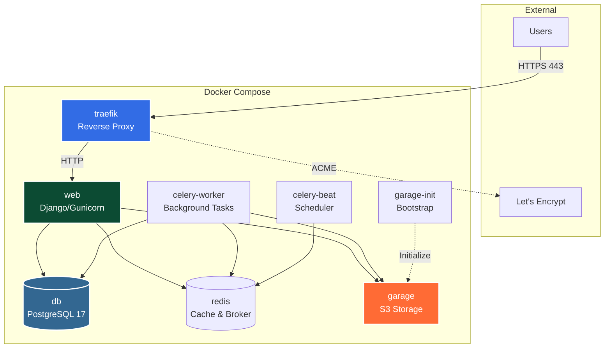

# PROPS — Platform Summary

**Property Register & Organisational Production System**

---

## Executive Summary

PROPS is a self-hosted asset tracking platform purpose-built for community organisations — theatre groups, schools, community centres, and clubs that accumulate physical assets across years of productions and events. It provides a complete, searchable inventory with photo cataloguing, location tracking, borrower accountability, barcode and NFC scanning, and an optional AI-powered capture workflow.

Built with Django, HTMX, and S3-compatible object storage, PROPS is designed to run on modest hardware while supporting organisations tracking up to 50,000 assets with 50 concurrent users.

---

## The Problem

Community organisations accumulate large numbers of physical assets over years — props, costumes, lights, sound gear, set pieces, and equipment. These assets are frequently moved between storage locations, borrowed by members, and shared across shows. Without a systematic tracking system, organisations face:

- **No inventory visibility** — items forgotten in unlabelled boxes or storage areas
- **Lost assets** — no record of last known location or who last handled them
- **Wasted time** — hours spent searching for assets that may not exist or are stored elsewhere
- **Duplicate purchases** — buying items the organisation already owns
- **No accountability** — no record of who borrowed or moved items
- **Insurance gaps** — inability to provide accurate inventories or valuations

PROPS solves these problems by providing a mobile-first web application that makes it easy to catalogue, track, and manage physical assets across multiple storage locations.

---

## How It Works

### Quick Capture

The primary workflow is designed for speed during moves and productions. A volunteer opens the camera on their mobile device, photographs an asset, optionally scans or assigns a barcode, and submits. The asset is created immediately as a draft with the photo and barcode attached. Details like name, description, category, and condition can be added later by the same person or another team member.

If the optional AI analysis feature is enabled, the system automatically queues the photo for analysis. Claude's vision model examines the image and suggests a name, description, category, tags, condition assessment, and any readable text visible in the photo. These suggestions appear as editable fields that the user can accept, modify, or dismiss.

### Check-In / Check-Out

Assets move through a tracked lifecycle. When a member borrows an asset, they check it out — recording who took it, when, and optionally why (e.g., "Guys & Dolls rehearsal"). When returned, the asset is checked back in with a timestamp. All movements are recorded in a transaction history that provides a complete audit trail.

Transfers between locations work similarly. An asset can be transferred from one storage location to another, with the system recording both the origin and destination. Bulk operations allow multiple assets to be checked out, checked in, or transferred simultaneously.

### Stocktake

The stocktake workflow enables systematic verification of assets at a location. A manager initiates a stocktake for a specific location, and team members scan or search for assets to confirm their presence. Assets found are marked as verified; assets expected but not found are flagged as missing. The stocktake report shows verification coverage and highlights discrepancies.

### Barcode & NFC

Every asset receives a unique barcode (Code128 format with a configurable prefix). Labels can be printed via the browser, a USB-connected printer, or a networked Zebra thermal label printer using ZPL commands. Assets can also be linked to NFC tags — particularly useful for costumes where a small NFC tag can be sewn into the garment. Android devices use the Web NFC API directly in the browser; iOS devices use NDEF URL records that open the asset page when tapped.

### AI-Powered Analysis

When enabled via the ANTHROPIC_API_KEY environment variable, PROPS uses Claude's vision models to analyse asset photos. The system sends the image to the API as a background Celery task and receives structured suggestions including name, description, category, tags, condition assessment, and OCR text. These suggestions are presented to the user as clearly marked AI-generated fields that can be accepted, edited, or dismissed. Configurable daily limits control API costs, and the feature can be disabled entirely.

---

## Data Model

PROPS organises data around a core set of entities:

- **Department** — organisational divisions (Props, Costumes, Technical, Sound, Lighting). Each department manages its own assets and members.
- **Category** — asset classification within a department (e.g., Furniture, Hand Props, Period Costumes). Categories can have parent-child relationships for hierarchical organisation.
- **Location** — physical storage locations with up to four levels of hierarchy (Building > Floor > Room > Shelf). Each location belongs to a department.
- **Asset** — the central entity. Each asset has a unique barcode, belongs to a department and category, has a current location, and carries metadata including name, description, condition, purchase price, estimated value, and photos.
- **Transaction** — every movement of an asset (check-out, check-in, transfer, stocktake verification) is recorded as a transaction with timestamps, the responsible user, and optional notes.
- **NFC Tag** — NFC tags can be assigned to assets with a full assignment history, supporting reuse of tags across different assets over time.
- **Stocktake** — a verification session for a location, tracking which assets were found and which were expected but missing.

### Asset States

Assets progress through a defined lifecycle:

| State | Description |
|-------|-------------|
| Draft | Newly captured, awaiting details |
| Active | Fully catalogued and available |
| Checked Out | Currently borrowed by a member |
| In Transit | Being transferred between locations |
| Disposed | Removed from active inventory |

---

## User Roles & Access Control

PROPS implements role-based access control with five levels:

| Role | Capabilities |
|------|-------------|
| System Admin | Full access — manage all departments, users, settings, and system configuration |
| Department Manager | Manage assets, locations, and members within their department(s). Approve new member registrations. |
| Member | View assets, check-in/check-out, create draft assets via Quick Capture |
| Viewer | Read-only access to asset catalogue and locations |
| Unapproved | Newly registered users awaiting manager approval |

New users register with an email and password, then must be approved by a Department Manager or System Admin before gaining access. This prevents unauthorised access while allowing self-service registration.

---

## Integrations

| Integration | Technology | Purpose |
|-------------|-----------|---------|
| Object Storage | Garage (S3-compatible) | Photo and attachment storage, self-hosted by default |
| Barcode Generation | python-barcode | Code128 barcodes with configurable prefix |
| Barcode Scanning | html5-qrcode | Browser-based camera scanning, no app required |
| Label Printing | ZPL over TCP | Direct printing to networked Zebra thermal printers |
| NFC | Web NFC API / NDEF URLs | Tag reading (Android) and URL-based linking (iOS) |
| AI Analysis | Anthropic Claude API | Optional image analysis for asset metadata suggestions |
| Excel Export | openpyxl | Asset reports with valuations for insurance |
| Background Tasks | Celery + Redis | Async photo processing, AI analysis, email delivery |
| Email | Django SMTP + MJML | Registration confirmation and notifications |
| Admin UI | django-unfold | Modern, mobile-responsive admin interface |

---

## Deployment

PROPS uses Docker Compose with two profiles:

- **dev** — Django development server on port 8003, all ports exposed, bind mounts for live editing
- **prod** — Gunicorn with 4 workers, Traefik v3.6 reverse proxy with automatic SSL via Let's Encrypt

The platform runs seven core services: **web** (Django), **db** (PostgreSQL 17), **redis** (broker + cache), **garage** (S3 storage), **garage-init** (bootstrap), **celery-worker** (background tasks), **celery-beat** (scheduler), and **traefik** (reverse proxy, production only).

An automated bootstrap script handles first-time setup: starting Garage, creating the S3 bucket, generating credentials, and populating the `.env` file.

### Server Requirements

| Resource | Minimum | Recommended |
|----------|---------|-------------|
| CPU | 1 vCPU | 2 vCPU |
| RAM | 2 GB | 4 GB |
| Disk | 10 GB | 20 GB |

Target scale: 50,000 assets, 50 concurrent users per instance.

---

## Configuration

All settings are managed through environment variables in a `.env` file, following the twelve-factor app methodology.

**Required Settings**

| Variable | Description |
|----------|-------------|
| `SECRET_KEY` | Django cryptographic signing key |
| `DATABASE_URL` | PostgreSQL connection string |
| `USE_S3` | Enable S3 object storage (`True`/`False`) |
| `S3_ENDPOINT_URL` | Garage/S3 endpoint |
| `S3_BUCKET_NAME` | Storage bucket name |
| `S3_ACCESS_KEY` | S3 access key |
| `S3_SECRET_KEY` | S3 secret key |
| `SITE_NAME` | Organisation display name |
| `BARCODE_PREFIX` | Asset barcode prefix |

**Optional Features**

| Variable | Description |
|----------|-------------|
| `ANTHROPIC_API_KEY` | Enables AI image analysis |
| `ZEBRA_PRINTER_HOST` | Enables network label printing |
| `EMAIL_HOST` | SMTP server for notifications |
| `BRAND_PRIMARY_COLOR` | Hex colour for automatic palette generation |
| `DOMAIN` | Production domain (for Traefik SSL) |

---

## Tech Stack

| Component | Technology |
|-----------|-----------|
| Backend | Django 5.x, Python 3.12 |
| Database | PostgreSQL 17 |
| Frontend | Django templates, HTMX, Tailwind CSS |
| Object Storage | Garage (S3-compatible) |
| Task Queue | Celery + Redis |
| Admin UI | django-unfold |
| Deployment | Docker Compose, Traefik v3.6 |
| Barcode | python-barcode (Code128), html5-qrcode (scanning) |
| NFC | Web NFC API (Android), NDEF URLs (iOS) |
| AI | Anthropic Claude (optional) |
| Export | openpyxl (Excel) |

---

## Scope Boundaries

### Not Included

The following are intentionally out of scope for PROPS:

- **External system integrations** — no connections to accounting, procurement, or facility management software
- **Native mobile app / PWA** — responsive web only, no offline support
- **Multi-provider AI** — Anthropic Claude only
- **Automated notifications** — no overdue reminders or scheduled alerts
- **Multi-tenancy** — one installation per organisation
- **Depreciation tracking** — no financial calculations or historical valuations
- **Two-factor authentication** — username/password only

These boundaries keep PROPS focused and maintainable for its target audience of community organisations that need robust asset tracking without enterprise complexity.

---

## License

PROPS is released under the **GNU Affero General Public License v3.0** (AGPL-3.0). This ensures the software remains open source even when hosted as a service — any organisation that deploys a modified version must make their source code available to users.

For organisations requiring proprietary modifications without source code publication, **commercial licensing** is available from Real World Technology Solutions (RWTS) at **sales@rwts.com.au**.

---

*Copyright 2024-2026 Real World Technology Solutions*
